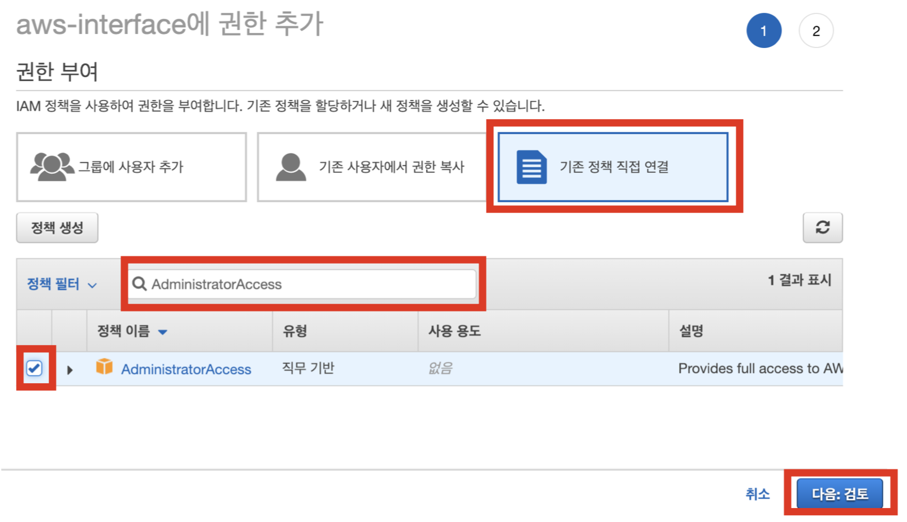

# Introduction

AWS-Interface lets you jump start your next big idea with a powerful and flexible backend. Amazon's web services were meant to be easy and simple—but they're simply not ☹️. There are often too many services for us mere mortals to track. With AWS Interface, we take away the nitty-gritty and let you focus on your ideas and your business.

Here's how it works: register your AWS IAM credentials for us to work with. Then, select the Service that you need for your backend service and tweak them through our website. That's it! We've built an infinitely scalable backend for your service via AWS services, and an auto-generated SDK for the frontend platform of your choice.

[Dashboard console](https://console.aws-interface.com)

# Quickstart
## Set AWS IAM AccessKey permissions
To use AWSI, you need to create a user with administrator rights in AWS IAM to obtain Access Key and SecretKey. AWS Account Creation and [Shortcut](https://aws.amazon.com/premiumsupport/knowledge-center/create-and-activate-aws-account/) Issuance of Key after IAM User Creation [Shortcut](https://docs.aws.amazon.com/IAM/latest/UserGuide/id_users_create.html)
Please refer to the shortcut. If you created an IAM user and received an Access Key and Secret Key, use IAM
You must grant the administrator authority to the person. In the AWS IAM console, select the user entry and add the
When you click it, you will see the following screen.

<br>

Click the Add Permission button in the above state, and then enter AdministratorAccess in the search box in the existing policy direct connection tab.
And check the AdministratorAccess entry to make it look like this:

<br>

Next: Click the Review button and click the Add Permissions button to grant AdministratorAccess permissions.

<br>

Again, on the Users> Permissions tab, verify that the AdministratorAccess permissions were successfully granted, and then click the Security Eligibility tab.
Go to the Create Access Keys button.

<br>


After that, the access key is automatically generated as shown below. At this time, click the Download .csv file button to save the key.

<br>

Now open the saved accessKeys.csv file and enter AccessKey and SecretKey at AWSI membership. You are now ready to use all the features of AWSI.
## Download SDK

> Create and prepare the SDK Client as follows

```shell
Install CURL (https://curl.haxx.se/)
```

```python
import aws_interface
client = aws_interface.Client()
```

```javascript
// Running in chrome
<script src="aws_interface.js"></script>
<script>
      const client = new Client();
</script>

// Running in node.js
const aws_interface = require('./aws_interface.js');
const client = new aws_interface.Client();
```


```java
AWSInterface client = new AWSInterface();
```

```swift
let client = AWSI()
```
At console.aws-interface.com/apps, click the Create New Backend button to create the backend with the desired name.
After about 3 minutes of AWS resource creation, download the SDK in the desired language.

<br>


# auth
Membership and User Management

## cloud.auth.attach_group_permission

> The question mark after the parameter means that the parameter is not required

```shell
curl "https://your_rest_api_url" -d '{
"module_name": "cloud.auth.attach_group_permission",
"group_name": "str",
"permission": "str",
"session_id?": "str"}'
```

```python
response = client.call_api("cloud.auth.attach_group_permission", {
 "group_name": "str",
 "permission": "str",
 "session_id?": "str"
})
print(response)
```

```javascript
client.callAPI("cloud.auth.attach_group_permission", {
 "group_name": "str",
 "permission": "str",
 "session_id?": "str"
}).then(function(response){
  console.log(JSON.stringify(response));
}).catch(function(error){
    console.log(error.error);
});
```


```java
HashMap<String, Object> data = new HashMap<>();
data.put("group_name", "str");
data.put("permission", "str");
data.put("session_id?", "str");

client.callAPI("cloud.auth.attach_group_permission", data, (response, hasError)->{
  System.out.println(response);
});
```

```swift
client.callAPI(module_name: "cloud.auth.guest", data: [
"group_name": "str",
"permission": "str",
"session_id?": "str",
]) { (response) in
  print(response)
}
```

> Expect output:

```json
{
 "error?": {
  "code": "int",
  "message": "str"
 },
 "success": "bool"
}
```

Attach permission to group

### HTTP Request

`POST https://you_rest_api_url/`

### Parameters
 
Parameter | Type | Value
--------- | ----------- | -----
module_name | str | "cloud.auth.attach_group_permission"
group_name | str
permission | str
session_id? | str


## cloud.auth.attach_user_group

> The question mark after the parameter means that the parameter is not required

```shell
curl "https://your_rest_api_url" -d '{
"module_name": "cloud.auth.attach_user_group",
"user_id": "str",
"group_name": "str",
"session_id?": "str"}'
```

```python
response = client.call_api("cloud.auth.attach_user_group", {
 "group_name": "str",
 "session_id?": "str",
 "user_id": "str"
})
print(response)
```

```javascript
client.callAPI("cloud.auth.attach_user_group", {
 "group_name": "str",
 "session_id?": "str",
 "user_id": "str"
}).then(function(response){
  console.log(JSON.stringify(response));
}).catch(function(error){
    console.log(error.error);
});
```


```java
HashMap<String, Object> data = new HashMap<>();
data.put("user_id", "str");
data.put("group_name", "str");
data.put("session_id?", "str");

client.callAPI("cloud.auth.attach_user_group", data, (response, hasError)->{
  System.out.println(response);
});
```

```swift
client.callAPI(module_name: "cloud.auth.guest", data: [
"user_id": "str",
"group_name": "str",
"session_id?": "str",
]) { (response) in
  print(response)
}
```

> Expect output:

```json
{
 "error?": {
  "code": "int",
  "message": "str"
 },
 "success": "bool"
}
```

Attach group to user

### HTTP Request

`POST https://you_rest_api_url/`

### Parameters
 
Parameter | Type | Value
--------- | ----------- | -----
module_name | str | "cloud.auth.attach_user_group"
user_id | str
group_name | str
session_id? | str


## cloud.auth.change_password

> The question mark after the parameter means that the parameter is not required

```shell
curl "https://your_rest_api_url" -d '{
"module_name": "cloud.auth.change_password",
"current_password": "str",
"new_password": "str",
"session_id?": "str"}'
```

```python
response = client.call_api("cloud.auth.change_password", {
 "current_password": "str",
 "new_password": "str",
 "session_id?": "str"
})
print(response)
```

```javascript
client.callAPI("cloud.auth.change_password", {
 "current_password": "str",
 "new_password": "str",
 "session_id?": "str"
}).then(function(response){
  console.log(JSON.stringify(response));
}).catch(function(error){
    console.log(error.error);
});
```


```java
HashMap<String, Object> data = new HashMap<>();
data.put("current_password", "str");
data.put("new_password", "str");
data.put("session_id?", "str");

client.callAPI("cloud.auth.change_password", data, (response, hasError)->{
  System.out.println(response);
});
```

```swift
client.callAPI(module_name: "cloud.auth.guest", data: [
"current_password": "str",
"new_password": "str",
"session_id?": "str",
]) { (response) in
  print(response)
}
```

> Expect output:

```json
{
 "error?": {
  "code": "int",
  "message": "str"
 },
 "user_id?": "str"
}
```

User can change current_password to new_password

### HTTP Request

`POST https://you_rest_api_url/`

### Parameters
 
Parameter | Type | Value
--------- | ----------- | -----
module_name | str | "cloud.auth.change_password"
current_password | str
new_password | str
session_id? | str


## cloud.auth.change_password_admin

> The question mark after the parameter means that the parameter is not required

```shell
curl "https://your_rest_api_url" -d '{
"module_name": "cloud.auth.change_password_admin",
"user_id": "str",
"new_password": "str",
"session_id?": "str"}'
```

```python
response = client.call_api("cloud.auth.change_password_admin", {
 "new_password": "str",
 "session_id?": "str",
 "user_id": "str"
})
print(response)
```

```javascript
client.callAPI("cloud.auth.change_password_admin", {
 "new_password": "str",
 "session_id?": "str",
 "user_id": "str"
}).then(function(response){
  console.log(JSON.stringify(response));
}).catch(function(error){
    console.log(error.error);
});
```


```java
HashMap<String, Object> data = new HashMap<>();
data.put("user_id", "str");
data.put("new_password", "str");
data.put("session_id?", "str");

client.callAPI("cloud.auth.change_password_admin", data, (response, hasError)->{
  System.out.println(response);
});
```

```swift
client.callAPI(module_name: "cloud.auth.guest", data: [
"user_id": "str",
"new_password": "str",
"session_id?": "str",
]) { (response) in
  print(response)
}
```

> Expect output:

```json
{
 "error?": {
  "code": "int",
  "message": "str"
 },
 "user_id?": "str"
}
```

Change password to new_password

### HTTP Request

`POST https://you_rest_api_url/`

### Parameters
 
Parameter | Type | Value
--------- | ----------- | -----
module_name | str | "cloud.auth.change_password_admin"
user_id | str
new_password | str
session_id? | str


## cloud.auth.delete_my_membership

> The question mark after the parameter means that the parameter is not required

```shell
curl "https://your_rest_api_url" -d '{
"module_name": "cloud.auth.delete_my_membership",
"session_id": "str"}'
```

```python
response = client.call_api("cloud.auth.delete_my_membership", {
 "session_id": "str"
})
print(response)
```

```javascript
client.callAPI("cloud.auth.delete_my_membership", {
 "session_id": "str"
}).then(function(response){
  console.log(JSON.stringify(response));
}).catch(function(error){
    console.log(error.error);
});
```


```java
HashMap<String, Object> data = new HashMap<>();
data.put("session_id", "str");

client.callAPI("cloud.auth.delete_my_membership", data, (response, hasError)->{
  System.out.println(response);
});
```

```swift
client.callAPI(module_name: "cloud.auth.guest", data: [
"session_id": "str",
]) { (response) in
  print(response)
}
```

> Expect output:

```json
{
 "error?": {
  "code": "int",
  "message": "str"
 },
 "success": "bool"
}
```

Delete my membership

### HTTP Request

`POST https://you_rest_api_url/`

### Parameters
 
Parameter | Type | Value
--------- | ----------- | -----
module_name | str | "cloud.auth.delete_my_membership"
session_id | str


## cloud.auth.delete_sessions

> The question mark after the parameter means that the parameter is not required

```shell
curl "https://your_rest_api_url" -d '{
"module_name": "cloud.auth.delete_sessions",
"session_ids": ["str"],
"max_workers": "int?",
"session_id?": "str"}'
```

```python
response = client.call_api("cloud.auth.delete_sessions", {
 "max_workers": "int?",
 "session_id?": "str",
 "session_ids": [
  "str"
 ]
})
print(response)
```

```javascript
client.callAPI("cloud.auth.delete_sessions", {
 "max_workers": "int?",
 "session_id?": "str",
 "session_ids": [
  "str"
 ]
}).then(function(response){
  console.log(JSON.stringify(response));
}).catch(function(error){
    console.log(error.error);
});
```


```java
HashMap<String, Object> data = new HashMap<>();
data.put("session_ids", ["str"]);
data.put("max_workers", "int?");
data.put("session_id?", "str");

client.callAPI("cloud.auth.delete_sessions", data, (response, hasError)->{
  System.out.println(response);
});
```

```swift
client.callAPI(module_name: "cloud.auth.guest", data: [
"session_ids": ["str"],
"max_workers": "int?",
"session_id?": "str",
]) { (response) in
  print(response)
}
```

> Expect output:

```json
{
 "error?": {
  "code": "int",
  "message": "str"
 },
 "success": "bool"
}
```

Delete sessions

### HTTP Request

`POST https://you_rest_api_url/`

### Parameters
 
Parameter | Type | Value
--------- | ----------- | -----
module_name | str | "cloud.auth.delete_sessions"
session_ids | [&#39;str&#39;]
max_workers | int?
session_id? | str


## cloud.auth.delete_user

> The question mark after the parameter means that the parameter is not required

```shell
curl "https://your_rest_api_url" -d '{
"module_name": "cloud.auth.delete_user",
"session_id": "str",
"user_id": "str"}'
```

```python
response = client.call_api("cloud.auth.delete_user", {
 "session_id": "str",
 "user_id": "str"
})
print(response)
```

```javascript
client.callAPI("cloud.auth.delete_user", {
 "session_id": "str",
 "user_id": "str"
}).then(function(response){
  console.log(JSON.stringify(response));
}).catch(function(error){
    console.log(error.error);
});
```


```java
HashMap<String, Object> data = new HashMap<>();
data.put("session_id", "str");
data.put("user_id", "str");

client.callAPI("cloud.auth.delete_user", data, (response, hasError)->{
  System.out.println(response);
});
```

```swift
client.callAPI(module_name: "cloud.auth.guest", data: [
"session_id": "str",
"user_id": "str",
]) { (response) in
  print(response)
}
```

> Expect output:

```json
{
 "error?": {
  "code": "int",
  "message": "str"
 },
 "success": "bool"
}
```

Delete user and delete session

### HTTP Request

`POST https://you_rest_api_url/`

### Parameters
 
Parameter | Type | Value
--------- | ----------- | -----
module_name | str | "cloud.auth.delete_user"
session_id | str
user_id | str


## cloud.auth.delete_user_group

> The question mark after the parameter means that the parameter is not required

```shell
curl "https://your_rest_api_url" -d '{
"module_name": "cloud.auth.delete_user_group",
"group_name": "str",
"session_id?": "str"}'
```

```python
response = client.call_api("cloud.auth.delete_user_group", {
 "group_name": "str",
 "session_id?": "str"
})
print(response)
```

```javascript
client.callAPI("cloud.auth.delete_user_group", {
 "group_name": "str",
 "session_id?": "str"
}).then(function(response){
  console.log(JSON.stringify(response));
}).catch(function(error){
    console.log(error.error);
});
```


```java
HashMap<String, Object> data = new HashMap<>();
data.put("group_name", "str");
data.put("session_id?", "str");

client.callAPI("cloud.auth.delete_user_group", data, (response, hasError)->{
  System.out.println(response);
});
```

```swift
client.callAPI(module_name: "cloud.auth.guest", data: [
"group_name": "str",
"session_id?": "str",
]) { (response) in
  print(response)
}
```

> Expect output:

```json
{
 "error?": {
  "code": "int",
  "message": "str"
 },
 "success": "bool"
}
```

Delete user group

### HTTP Request

`POST https://you_rest_api_url/`

### Parameters
 
Parameter | Type | Value
--------- | ----------- | -----
module_name | str | "cloud.auth.delete_user_group"
group_name | str
session_id? | str


## cloud.auth.detach_user_group

> The question mark after the parameter means that the parameter is not required

```shell
curl "https://your_rest_api_url" -d '{
"module_name": "cloud.auth.detach_user_group",
"user_id": "str",
"group_name": "str",
"session_id?": "str"}'
```

```python
response = client.call_api("cloud.auth.detach_user_group", {
 "group_name": "str",
 "session_id?": "str",
 "user_id": "str"
})
print(response)
```

```javascript
client.callAPI("cloud.auth.detach_user_group", {
 "group_name": "str",
 "session_id?": "str",
 "user_id": "str"
}).then(function(response){
  console.log(JSON.stringify(response));
}).catch(function(error){
    console.log(error.error);
});
```


```java
HashMap<String, Object> data = new HashMap<>();
data.put("user_id", "str");
data.put("group_name", "str");
data.put("session_id?", "str");

client.callAPI("cloud.auth.detach_user_group", data, (response, hasError)->{
  System.out.println(response);
});
```

```swift
client.callAPI(module_name: "cloud.auth.guest", data: [
"user_id": "str",
"group_name": "str",
"session_id?": "str",
]) { (response) in
  print(response)
}
```

> Expect output:

```json
{
 "error?": {
  "code": "int",
  "message": "str"
 },
 "success": "bool"
}
```

Detach user group from user

### HTTP Request

`POST https://you_rest_api_url/`

### Parameters
 
Parameter | Type | Value
--------- | ----------- | -----
module_name | str | "cloud.auth.detach_user_group"
user_id | str
group_name | str
session_id? | str


## cloud.auth.find_password

> The question mark after the parameter means that the parameter is not required

```shell
curl "https://your_rest_api_url" -d '{
"module_name": "cloud.auth.find_password",
"email": "str",
"verification_code": "str?",
"new_password": "str?",
"session_id?": "str"}'
```

```python
response = client.call_api("cloud.auth.find_password", {
 "email": "str",
 "new_password": "str?",
 "session_id?": "str",
 "verification_code": "str?"
})
print(response)
```

```javascript
client.callAPI("cloud.auth.find_password", {
 "email": "str",
 "new_password": "str?",
 "session_id?": "str",
 "verification_code": "str?"
}).then(function(response){
  console.log(JSON.stringify(response));
}).catch(function(error){
    console.log(error.error);
});
```


```java
HashMap<String, Object> data = new HashMap<>();
data.put("email", "str");
data.put("verification_code", "str?");
data.put("new_password", "str?");
data.put("session_id?", "str");

client.callAPI("cloud.auth.find_password", data, (response, hasError)->{
  System.out.println(response);
});
```

```swift
client.callAPI(module_name: "cloud.auth.guest", data: [
"email": "str",
"verification_code": "str?",
"new_password": "str?",
"session_id?": "str",
]) { (response) in
  print(response)
}
```

> Expect output:

```json
{
 "error?": {
  "code": "int",
  "message": "str"
 },
 "message": "str",
 "user_id?": "str"
}
```

1. Send verification code to email, 2. Enter the verification code and new_password

### HTTP Request

`POST https://you_rest_api_url/`

### Parameters
 
Parameter | Type | Value
--------- | ----------- | -----
module_name | str | "cloud.auth.find_password"
email | str
verification_code | str?
new_password | str?
session_id? | str


## cloud.auth.get_all_permissions

> The question mark after the parameter means that the parameter is not required

```shell
curl "https://your_rest_api_url" -d '{
"module_name": "cloud.auth.get_all_permissions",
"session_id?": "str"}'
```

```python
response = client.call_api("cloud.auth.get_all_permissions", {
 "session_id?": "str"
})
print(response)
```

```javascript
client.callAPI("cloud.auth.get_all_permissions", {
 "session_id?": "str"
}).then(function(response){
  console.log(JSON.stringify(response));
}).catch(function(error){
    console.log(error.error);
});
```


```java
HashMap<String, Object> data = new HashMap<>();
data.put("session_id?", "str");

client.callAPI("cloud.auth.get_all_permissions", data, (response, hasError)->{
  System.out.println(response);
});
```

```swift
client.callAPI(module_name: "cloud.auth.guest", data: [
"session_id?": "str",
]) { (response) in
  print(response)
}
```

> Expect output:

```json
{
 "error?": {
  "code": "int",
  "message": "str"
 },
 "permissions": [
  "str"
 ]
}
```

Return all permissions in AWSI

### HTTP Request

`POST https://you_rest_api_url/`

### Parameters
 
Parameter | Type | Value
--------- | ----------- | -----
module_name | str | "cloud.auth.get_all_permissions"
session_id? | str


## cloud.auth.get_me

> The question mark after the parameter means that the parameter is not required

```shell
curl "https://your_rest_api_url" -d '{
"module_name": "cloud.auth.get_me",
"session_id": "str",
"__est": "str?"}'
```

```python
response = client.call_api("cloud.auth.get_me", {
 "__est": "str?",
 "session_id": "str"
})
print(response)
```

```javascript
client.callAPI("cloud.auth.get_me", {
 "__est": "str?",
 "session_id": "str"
}).then(function(response){
  console.log(JSON.stringify(response));
}).catch(function(error){
    console.log(error.error);
});
```


```java
HashMap<String, Object> data = new HashMap<>();
data.put("session_id", "str");
data.put("__est", "str?");

client.callAPI("cloud.auth.get_me", data, (response, hasError)->{
  System.out.println(response);
});
```

```swift
client.callAPI(module_name: "cloud.auth.guest", data: [
"session_id": "str",
"__est": "str?",
]) { (response) in
  print(response)
}
```

> Expect output:

```json
{
 "error?": {
  "code": "int",
  "message": "str"
 },
 "item?": {
  "creationDate": "int",
  "email": "str",
  "groups": [
   "str"
  ],
  "id": "str",
  "passwordHash": "str",
  "salt": "str"
 }
}
```

Get my information via session

### HTTP Request

`POST https://you_rest_api_url/`

### Parameters
 
Parameter | Type | Value
--------- | ----------- | -----
module_name | str | "cloud.auth.get_me"
session_id | str
__est | str?


## cloud.auth.get_session

> The question mark after the parameter means that the parameter is not required

```shell
curl "https://your_rest_api_url" -d '{
"module_name": "cloud.auth.get_session",
"session_id": "str"}'
```

```python
response = client.call_api("cloud.auth.get_session", {
 "session_id": "str"
})
print(response)
```

```javascript
client.callAPI("cloud.auth.get_session", {
 "session_id": "str"
}).then(function(response){
  console.log(JSON.stringify(response));
}).catch(function(error){
    console.log(error.error);
});
```


```java
HashMap<String, Object> data = new HashMap<>();
data.put("session_id", "str");

client.callAPI("cloud.auth.get_session", data, (response, hasError)->{
  System.out.println(response);
});
```

```swift
client.callAPI(module_name: "cloud.auth.guest", data: [
"session_id": "str",
]) { (response) in
  print(response)
}
```

> Expect output:

```json
{
 "error?": {
  "code": "int",
  "message": "str"
 },
 "item": {
  "creationDate": "int",
  "id": "str"
 }
}
```

Return session item

### HTTP Request

`POST https://you_rest_api_url/`

### Parameters
 
Parameter | Type | Value
--------- | ----------- | -----
module_name | str | "cloud.auth.get_session"
session_id | str


## cloud.auth.get_session_count

> The question mark after the parameter means that the parameter is not required

```shell
curl "https://your_rest_api_url" -d '{
"module_name": "cloud.auth.get_session_count",
"session_id?": "str"}'
```

```python
response = client.call_api("cloud.auth.get_session_count", {
 "session_id?": "str"
})
print(response)
```

```javascript
client.callAPI("cloud.auth.get_session_count", {
 "session_id?": "str"
}).then(function(response){
  console.log(JSON.stringify(response));
}).catch(function(error){
    console.log(error.error);
});
```


```java
HashMap<String, Object> data = new HashMap<>();
data.put("session_id?", "str");

client.callAPI("cloud.auth.get_session_count", data, (response, hasError)->{
  System.out.println(response);
});
```

```swift
client.callAPI(module_name: "cloud.auth.guest", data: [
"session_id?": "str",
]) { (response) in
  print(response)
}
```

> Expect output:

```json
{
 "error?": {
  "code": "int",
  "message": "str"
 },
 "item": {
  "count": "int"
 }
}
```

Return count of all sessions

### HTTP Request

`POST https://you_rest_api_url/`

### Parameters
 
Parameter | Type | Value
--------- | ----------- | -----
module_name | str | "cloud.auth.get_session_count"
session_id? | str


## cloud.auth.get_sessions

> The question mark after the parameter means that the parameter is not required

```shell
curl "https://your_rest_api_url" -d '{
"module_name": "cloud.auth.get_sessions",
"start_key": "str",
"query": "list?",
"session_id?": "str"}'
```

```python
response = client.call_api("cloud.auth.get_sessions", {
 "query": "list?",
 "session_id?": "str",
 "start_key": "str"
})
print(response)
```

```javascript
client.callAPI("cloud.auth.get_sessions", {
 "query": "list?",
 "session_id?": "str",
 "start_key": "str"
}).then(function(response){
  console.log(JSON.stringify(response));
}).catch(function(error){
    console.log(error.error);
});
```


```java
HashMap<String, Object> data = new HashMap<>();
data.put("start_key", "str");
data.put("query", "list?");
data.put("session_id?", "str");

client.callAPI("cloud.auth.get_sessions", data, (response, hasError)->{
  System.out.println(response);
});
```

```swift
client.callAPI(module_name: "cloud.auth.guest", data: [
"start_key": "str",
"query": "list?",
"session_id?": "str",
]) { (response) in
  print(response)
}
```

> Expect output:

```json
{
 "end_key": "str",
 "error?": {
  "code": "int",
  "message": "str"
 },
 "items": [
  {
   "str": "any"
  }
 ]
}
```

Return sessions

### HTTP Request

`POST https://you_rest_api_url/`

### Parameters
 
Parameter | Type | Value
--------- | ----------- | -----
module_name | str | "cloud.auth.get_sessions"
start_key | str
query | list?
session_id? | str


## cloud.auth.get_user

> The question mark after the parameter means that the parameter is not required

```shell
curl "https://your_rest_api_url" -d '{
"module_name": "cloud.auth.get_user",
"user_id": "str",
"session_id?": "str"}'
```

```python
response = client.call_api("cloud.auth.get_user", {
 "session_id?": "str",
 "user_id": "str"
})
print(response)
```

```javascript
client.callAPI("cloud.auth.get_user", {
 "session_id?": "str",
 "user_id": "str"
}).then(function(response){
  console.log(JSON.stringify(response));
}).catch(function(error){
    console.log(error.error);
});
```


```java
HashMap<String, Object> data = new HashMap<>();
data.put("user_id", "str");
data.put("session_id?", "str");

client.callAPI("cloud.auth.get_user", data, (response, hasError)->{
  System.out.println(response);
});
```

```swift
client.callAPI(module_name: "cloud.auth.guest", data: [
"user_id": "str",
"session_id?": "str",
]) { (response) in
  print(response)
}
```

> Expect output:

```json
{
 "error?": {
  "code": "int",
  "message": "str"
 },
 "item": {
  "...": "...",
  "creationDate": "int",
  "email": "str",
  "groups": "list",
  "id": "str",
  "passwordHash": "str",
  "salt": "str"
 }
}
```

Return user item by user_id

### HTTP Request

`POST https://you_rest_api_url/`

### Parameters
 
Parameter | Type | Value
--------- | ----------- | -----
module_name | str | "cloud.auth.get_user"
user_id | str
session_id? | str


## cloud.auth.get_user_by_email

> The question mark after the parameter means that the parameter is not required

```shell
curl "https://your_rest_api_url" -d '{
"module_name": "cloud.auth.get_user_by_email",
"email": "str",
"session_id?": "str"}'
```

```python
response = client.call_api("cloud.auth.get_user_by_email", {
 "email": "str",
 "session_id?": "str"
})
print(response)
```

```javascript
client.callAPI("cloud.auth.get_user_by_email", {
 "email": "str",
 "session_id?": "str"
}).then(function(response){
  console.log(JSON.stringify(response));
}).catch(function(error){
    console.log(error.error);
});
```


```java
HashMap<String, Object> data = new HashMap<>();
data.put("email", "str");
data.put("session_id?", "str");

client.callAPI("cloud.auth.get_user_by_email", data, (response, hasError)->{
  System.out.println(response);
});
```

```swift
client.callAPI(module_name: "cloud.auth.guest", data: [
"email": "str",
"session_id?": "str",
]) { (response) in
  print(response)
}
```

> Expect output:

```json
{
 "error?": {
  "code": "int",
  "message": "str"
 },
 "item": {
  "...": "...",
  "creationDate": "int",
  "email": "str",
  "groups": "list",
  "id": "str",
  "passwordHash": "str",
  "salt": "str"
 }
}
```

Return user by email

### HTTP Request

`POST https://you_rest_api_url/`

### Parameters
 
Parameter | Type | Value
--------- | ----------- | -----
module_name | str | "cloud.auth.get_user_by_email"
email | str
session_id? | str


## cloud.auth.get_user_count

> The question mark after the parameter means that the parameter is not required

```shell
curl "https://your_rest_api_url" -d '{
"module_name": "cloud.auth.get_user_count",
"count_system_user": "bool",
"session_id?": "str"}'
```

```python
response = client.call_api("cloud.auth.get_user_count", {
 "count_system_user": "bool",
 "session_id?": "str"
})
print(response)
```

```javascript
client.callAPI("cloud.auth.get_user_count", {
 "count_system_user": "bool",
 "session_id?": "str"
}).then(function(response){
  console.log(JSON.stringify(response));
}).catch(function(error){
    console.log(error.error);
});
```


```java
HashMap<String, Object> data = new HashMap<>();
data.put("count_system_user", "bool");
data.put("session_id?", "str");

client.callAPI("cloud.auth.get_user_count", data, (response, hasError)->{
  System.out.println(response);
});
```

```swift
client.callAPI(module_name: "cloud.auth.guest", data: [
"count_system_user": "bool",
"session_id?": "str",
]) { (response) in
  print(response)
}
```

> Expect output:

```json
{
 "error?": {
  "code": "int",
  "message": "str"
 },
 "item": {
  "count": "int"
 }
}
```

Return count of all users

### HTTP Request

`POST https://you_rest_api_url/`

### Parameters
 
Parameter | Type | Value
--------- | ----------- | -----
module_name | str | "cloud.auth.get_user_count"
count_system_user | bool
session_id? | str


## cloud.auth.get_user_groups

> The question mark after the parameter means that the parameter is not required

```shell
curl "https://your_rest_api_url" -d '{
"module_name": "cloud.auth.get_user_groups",
"session_id?": "str"}'
```

```python
response = client.call_api("cloud.auth.get_user_groups", {
 "session_id?": "str"
})
print(response)
```

```javascript
client.callAPI("cloud.auth.get_user_groups", {
 "session_id?": "str"
}).then(function(response){
  console.log(JSON.stringify(response));
}).catch(function(error){
    console.log(error.error);
});
```


```java
HashMap<String, Object> data = new HashMap<>();
data.put("session_id?", "str");

client.callAPI("cloud.auth.get_user_groups", data, (response, hasError)->{
  System.out.println(response);
});
```

```swift
client.callAPI(module_name: "cloud.auth.guest", data: [
"session_id?": "str",
]) { (response) in
  print(response)
}
```

> Expect output:

```json
{
 "error?": {
  "code": "int",
  "message": "str"
 },
 "groups": [
  {
   "str": "any"
  }
 ]
}
```

Return all groups enrolled in system

### HTTP Request

`POST https://you_rest_api_url/`

### Parameters
 
Parameter | Type | Value
--------- | ----------- | -----
module_name | str | "cloud.auth.get_user_groups"
session_id? | str


## cloud.auth.get_users

> The question mark after the parameter means that the parameter is not required

```shell
curl "https://your_rest_api_url" -d '{
"module_name": "cloud.auth.get_users",
"start_key?": "str",
"limit?": "int",
"show_system_user?": "bool",
"query?": "list",
"session_id?": "str"}'
```

```python
response = client.call_api("cloud.auth.get_users", {
 "limit?": "int",
 "query?": "list",
 "session_id?": "str",
 "show_system_user?": "bool",
 "start_key?": "str"
})
print(response)
```

```javascript
client.callAPI("cloud.auth.get_users", {
 "limit?": "int",
 "query?": "list",
 "session_id?": "str",
 "show_system_user?": "bool",
 "start_key?": "str"
}).then(function(response){
  console.log(JSON.stringify(response));
}).catch(function(error){
    console.log(error.error);
});
```


```java
HashMap<String, Object> data = new HashMap<>();
data.put("start_key?", "str");
data.put("limit?", "int");
data.put("show_system_user?", "bool");
data.put("query?", "list");
data.put("session_id?", "str");

client.callAPI("cloud.auth.get_users", data, (response, hasError)->{
  System.out.println(response);
});
```

```swift
client.callAPI(module_name: "cloud.auth.guest", data: [
"start_key?": "str",
"limit?": "int",
"show_system_user?": "bool",
"query?": "list",
"session_id?": "str",
]) { (response) in
  print(response)
}
```

> Expect output:

```json
{
 "end_key?": "str",
 "error?": {
  "code": "int",
  "message": "str"
 },
 "items": [
  {
   "...": "...",
   "creationDate": "int",
   "email": "str",
   "group": "str",
   "id": "str",
   "passwordHash": "str",
   "salt": "str"
  }
 ]
}
```

Return all users in system

### HTTP Request

`POST https://you_rest_api_url/`

### Parameters
 
Parameter | Type | Value
--------- | ----------- | -----
module_name | str | "cloud.auth.get_users"
start_key? | str
limit? | int
show_system_user? | bool
query? | list
session_id? | str


## cloud.auth.guest

> The question mark after the parameter means that the parameter is not required

```shell
curl "https://your_rest_api_url" -d '{
"module_name": "cloud.auth.guest",
"session_id?": "str"}'
```

```python
response = client.call_api("cloud.auth.guest", {
 "session_id?": "str"
})
print(response)
```

```javascript
client.callAPI("cloud.auth.guest", {
 "session_id?": "str"
}).then(function(response){
  console.log(JSON.stringify(response));
}).catch(function(error){
    console.log(error.error);
});
```


```java
HashMap<String, Object> data = new HashMap<>();
data.put("session_id?", "str");

client.callAPI("cloud.auth.guest", data, (response, hasError)->{
  System.out.println(response);
});
```

```swift
client.callAPI(module_name: "cloud.auth.guest", data: [
"session_id?": "str",
]) { (response) in
  print(response)
}
```

> Expect output:

```json
{
 "error?": {
  "code": "int",
  "message": "str"
 },
 "session_id": "str"
}
```

Guest login. If you save guest_id after login and send it as a parameter after logout, you can keep your guest status.

### HTTP Request

`POST https://you_rest_api_url/`

### Parameters
 
Parameter | Type | Value
--------- | ----------- | -----
module_name | str | "cloud.auth.guest"
session_id? | str


## cloud.auth.has_account

> The question mark after the parameter means that the parameter is not required

```shell
curl "https://your_rest_api_url" -d '{
"module_name": "cloud.auth.has_account",
"email": "str",
"session_id?": "str"}'
```

```python
response = client.call_api("cloud.auth.has_account", {
 "email": "str",
 "session_id?": "str"
})
print(response)
```

```javascript
client.callAPI("cloud.auth.has_account", {
 "email": "str",
 "session_id?": "str"
}).then(function(response){
  console.log(JSON.stringify(response));
}).catch(function(error){
    console.log(error.error);
});
```


```java
HashMap<String, Object> data = new HashMap<>();
data.put("email", "str");
data.put("session_id?", "str");

client.callAPI("cloud.auth.has_account", data, (response, hasError)->{
  System.out.println(response);
});
```

```swift
client.callAPI(module_name: "cloud.auth.guest", data: [
"email": "str",
"session_id?": "str",
]) { (response) in
  print(response)
}
```

> Expect output:

```json
{
 "error?": {
  "code": "int",
  "message": "str"
 },
 "has_account": "bool"
}
```

Check account exist

### HTTP Request

`POST https://you_rest_api_url/`

### Parameters
 
Parameter | Type | Value
--------- | ----------- | -----
module_name | str | "cloud.auth.has_account"
email | str
session_id? | str


## cloud.auth.login

> The question mark after the parameter means that the parameter is not required

```shell
curl "https://your_rest_api_url" -d '{
"module_name": "cloud.auth.login",
"email": "str",
"password": "str",
"session_id?": "str"}'
```

```python
response = client.call_api("cloud.auth.login", {
 "email": "str",
 "password": "str",
 "session_id?": "str"
})
print(response)
```

```javascript
client.callAPI("cloud.auth.login", {
 "email": "str",
 "password": "str",
 "session_id?": "str"
}).then(function(response){
  console.log(JSON.stringify(response));
}).catch(function(error){
    console.log(error.error);
});
```


```java
HashMap<String, Object> data = new HashMap<>();
data.put("email", "str");
data.put("password", "str");
data.put("session_id?", "str");

client.callAPI("cloud.auth.login", data, (response, hasError)->{
  System.out.println(response);
});
```

```swift
client.callAPI(module_name: "cloud.auth.guest", data: [
"email": "str",
"password": "str",
"session_id?": "str",
]) { (response) in
  print(response)
}
```

> Expect output:

```json
{
 "error?": {
  "code": "int",
  "message": "str"
 },
 "session_id": "str",
 "user_id": "str"
}
```

Sign-in by email and password

### HTTP Request

`POST https://you_rest_api_url/`

### Parameters
 
Parameter | Type | Value
--------- | ----------- | -----
module_name | str | "cloud.auth.login"
email | str
password | str
session_id? | str


## cloud.auth.login_facebook

> The question mark after the parameter means that the parameter is not required

```shell
curl "https://your_rest_api_url" -d '{
"module_name": "cloud.auth.login_facebook",
"access_token": "str",
"session_id?": "str"}'
```

```python
response = client.call_api("cloud.auth.login_facebook", {
 "access_token": "str",
 "session_id?": "str"
})
print(response)
```

```javascript
client.callAPI("cloud.auth.login_facebook", {
 "access_token": "str",
 "session_id?": "str"
}).then(function(response){
  console.log(JSON.stringify(response));
}).catch(function(error){
    console.log(error.error);
});
```


```java
HashMap<String, Object> data = new HashMap<>();
data.put("access_token", "str");
data.put("session_id?", "str");

client.callAPI("cloud.auth.login_facebook", data, (response, hasError)->{
  System.out.println(response);
});
```

```swift
client.callAPI(module_name: "cloud.auth.guest", data: [
"access_token": "str",
"session_id?": "str",
]) { (response) in
  print(response)
}
```

> Expect output:

```json
{
 "error?": {
  "code": "int",
  "message": "str"
 },
 "session_id": "str"
}
```

Sign-in by access_token from facebook sdk [scopes=id,email]

### HTTP Request

`POST https://you_rest_api_url/`

### Parameters
 
Parameter | Type | Value
--------- | ----------- | -----
module_name | str | "cloud.auth.login_facebook"
access_token | str
session_id? | str


## cloud.auth.login_google

> The question mark after the parameter means that the parameter is not required

```shell
curl "https://your_rest_api_url" -d '{
"module_name": "cloud.auth.login_google",
"id_token": "str",
"session_id?": "str"}'
```

```python
response = client.call_api("cloud.auth.login_google", {
 "id_token": "str",
 "session_id?": "str"
})
print(response)
```

```javascript
client.callAPI("cloud.auth.login_google", {
 "id_token": "str",
 "session_id?": "str"
}).then(function(response){
  console.log(JSON.stringify(response));
}).catch(function(error){
    console.log(error.error);
});
```


```java
HashMap<String, Object> data = new HashMap<>();
data.put("id_token", "str");
data.put("session_id?", "str");

client.callAPI("cloud.auth.login_google", data, (response, hasError)->{
  System.out.println(response);
});
```

```swift
client.callAPI(module_name: "cloud.auth.guest", data: [
"id_token": "str",
"session_id?": "str",
]) { (response) in
  print(response)
}
```

> Expect output:

```json
{
 "error?": {
  "code": "int",
  "message": "str"
 },
 "session_id": "str"
}
```

Sign-in by id_token from google sdk

### HTTP Request

`POST https://you_rest_api_url/`

### Parameters
 
Parameter | Type | Value
--------- | ----------- | -----
module_name | str | "cloud.auth.login_google"
id_token | str
session_id? | str


## cloud.auth.login_kakao

> The question mark after the parameter means that the parameter is not required

```shell
curl "https://your_rest_api_url" -d '{
"module_name": "cloud.auth.login_kakao",
"access_token": "str",
"session_id?": "str"}'
```

```python
response = client.call_api("cloud.auth.login_kakao", {
 "access_token": "str",
 "session_id?": "str"
})
print(response)
```

```javascript
client.callAPI("cloud.auth.login_kakao", {
 "access_token": "str",
 "session_id?": "str"
}).then(function(response){
  console.log(JSON.stringify(response));
}).catch(function(error){
    console.log(error.error);
});
```


```java
HashMap<String, Object> data = new HashMap<>();
data.put("access_token", "str");
data.put("session_id?", "str");

client.callAPI("cloud.auth.login_kakao", data, (response, hasError)->{
  System.out.println(response);
});
```

```swift
client.callAPI(module_name: "cloud.auth.guest", data: [
"access_token": "str",
"session_id?": "str",
]) { (response) in
  print(response)
}
```

> Expect output:

```json
{
 "error?": {
  "code": "int",
  "message": "str"
 },
 "session_id": "str"
}
```

Sign-in by access_token from kakao login sdk

### HTTP Request

`POST https://you_rest_api_url/`

### Parameters
 
Parameter | Type | Value
--------- | ----------- | -----
module_name | str | "cloud.auth.login_kakao"
access_token | str
session_id? | str


## cloud.auth.login_naver

> The question mark after the parameter means that the parameter is not required

```shell
curl "https://your_rest_api_url" -d '{
"module_name": "cloud.auth.login_naver",
"access_token": "str",
"session_id?": "str"}'
```

```python
response = client.call_api("cloud.auth.login_naver", {
 "access_token": "str",
 "session_id?": "str"
})
print(response)
```

```javascript
client.callAPI("cloud.auth.login_naver", {
 "access_token": "str",
 "session_id?": "str"
}).then(function(response){
  console.log(JSON.stringify(response));
}).catch(function(error){
    console.log(error.error);
});
```


```java
HashMap<String, Object> data = new HashMap<>();
data.put("access_token", "str");
data.put("session_id?", "str");

client.callAPI("cloud.auth.login_naver", data, (response, hasError)->{
  System.out.println(response);
});
```

```swift
client.callAPI(module_name: "cloud.auth.guest", data: [
"access_token": "str",
"session_id?": "str",
]) { (response) in
  print(response)
}
```

> Expect output:

```json
{
 "error?": {
  "code": "int",
  "message": "str"
 },
 "session_id": "str"
}
```

Sign-in by access_token from naver login sdk

### HTTP Request

`POST https://you_rest_api_url/`

### Parameters
 
Parameter | Type | Value
--------- | ----------- | -----
module_name | str | "cloud.auth.login_naver"
access_token | str
session_id? | str


## cloud.auth.login_secure

> The question mark after the parameter means that the parameter is not required

```shell
curl "https://your_rest_api_url" -d '{
"module_name": "cloud.auth.login_secure",
"email": "str",
"password": "str",
"session_id?": "str"}'
```

```python
response = client.call_api("cloud.auth.login_secure", {
 "email": "str",
 "password": "str",
 "session_id?": "str"
})
print(response)
```

```javascript
client.callAPI("cloud.auth.login_secure", {
 "email": "str",
 "password": "str",
 "session_id?": "str"
}).then(function(response){
  console.log(JSON.stringify(response));
}).catch(function(error){
    console.log(error.error);
});
```


```java
HashMap<String, Object> data = new HashMap<>();
data.put("email", "str");
data.put("password", "str");
data.put("session_id?", "str");

client.callAPI("cloud.auth.login_secure", data, (response, hasError)->{
  System.out.println(response);
});
```

```swift
client.callAPI(module_name: "cloud.auth.guest", data: [
"email": "str",
"password": "str",
"session_id?": "str",
]) { (response) in
  print(response)
}
```

> Expect output:

```json
{
 "__spk": "str",
 "error?": {
  "code": "int",
  "message": "str"
 },
 "session_id": "str",
 "user_id": "str"
}
```

Secure Login: When you request to server from client, you should insert key name &#34;__est&#34;: SHA3_512(&lt;str(int(time.time()))&gt; + __spk) in payloadtime.time() must be seconds (NOT MS) 

### HTTP Request

`POST https://you_rest_api_url/`

### Parameters
 
Parameter | Type | Value
--------- | ----------- | -----
module_name | str | "cloud.auth.login_secure"
email | str
password | str
session_id? | str


## cloud.auth.logout

> The question mark after the parameter means that the parameter is not required

```shell
curl "https://your_rest_api_url" -d '{
"module_name": "cloud.auth.logout",
"session_id": "str"}'
```

```python
response = client.call_api("cloud.auth.logout", {
 "session_id": "str"
})
print(response)
```

```javascript
client.callAPI("cloud.auth.logout", {
 "session_id": "str"
}).then(function(response){
  console.log(JSON.stringify(response));
}).catch(function(error){
    console.log(error.error);
});
```


```java
HashMap<String, Object> data = new HashMap<>();
data.put("session_id", "str");

client.callAPI("cloud.auth.logout", data, (response, hasError)->{
  System.out.println(response);
});
```

```swift
client.callAPI(module_name: "cloud.auth.guest", data: [
"session_id": "str",
]) { (response) in
  print(response)
}
```

> Expect output:

```json
{
 "error?": {
  "code": "int",
  "message": "str"
 },
 "success": "bool"
}
```

Sign-out and remove session

### HTTP Request

`POST https://you_rest_api_url/`

### Parameters
 
Parameter | Type | Value
--------- | ----------- | -----
module_name | str | "cloud.auth.logout"
session_id | str


## cloud.auth.put_user_group

> The question mark after the parameter means that the parameter is not required

```shell
curl "https://your_rest_api_url" -d '{
"module_name": "cloud.auth.put_user_group",
"group_name": "str",
"description": "str",
"permissions": ["str"],
"session_id?": "str"}'
```

```python
response = client.call_api("cloud.auth.put_user_group", {
 "description": "str",
 "group_name": "str",
 "permissions": [
  "str"
 ],
 "session_id?": "str"
})
print(response)
```

```javascript
client.callAPI("cloud.auth.put_user_group", {
 "description": "str",
 "group_name": "str",
 "permissions": [
  "str"
 ],
 "session_id?": "str"
}).then(function(response){
  console.log(JSON.stringify(response));
}).catch(function(error){
    console.log(error.error);
});
```


```java
HashMap<String, Object> data = new HashMap<>();
data.put("group_name", "str");
data.put("description", "str");
data.put("permissions", ["str"]);
data.put("session_id?", "str");

client.callAPI("cloud.auth.put_user_group", data, (response, hasError)->{
  System.out.println(response);
});
```

```swift
client.callAPI(module_name: "cloud.auth.guest", data: [
"group_name": "str",
"description": "str",
"permissions": ["str"],
"session_id?": "str",
]) { (response) in
  print(response)
}
```

> Expect output:

```json
{
 "error?": {
  "code": "int",
  "message": "str"
 },
 "success": "bool"
}
```

Put a group to system

### HTTP Request

`POST https://you_rest_api_url/`

### Parameters
 
Parameter | Type | Value
--------- | ----------- | -----
module_name | str | "cloud.auth.put_user_group"
group_name | str
description | str
permissions | [&#39;str&#39;]
session_id? | str


## cloud.auth.refresh_session

> The question mark after the parameter means that the parameter is not required

```shell
curl "https://your_rest_api_url" -d '{
"module_name": "cloud.auth.refresh_session",
"session_id": "str"}'
```

```python
response = client.call_api("cloud.auth.refresh_session", {
 "session_id": "str"
})
print(response)
```

```javascript
client.callAPI("cloud.auth.refresh_session", {
 "session_id": "str"
}).then(function(response){
  console.log(JSON.stringify(response));
}).catch(function(error){
    console.log(error.error);
});
```


```java
HashMap<String, Object> data = new HashMap<>();
data.put("session_id", "str");

client.callAPI("cloud.auth.refresh_session", data, (response, hasError)->{
  System.out.println(response);
});
```

```swift
client.callAPI(module_name: "cloud.auth.guest", data: [
"session_id": "str",
]) { (response) in
  print(response)
}
```

> Expect output:

```json
{
 "error?": {
  "code": "int",
  "message": "str"
 },
 "session_id": "str"
}
```

Refresh session

### HTTP Request

`POST https://you_rest_api_url/`

### Parameters
 
Parameter | Type | Value
--------- | ----------- | -----
module_name | str | "cloud.auth.refresh_session"
session_id | str


## cloud.auth.register

> The question mark after the parameter means that the parameter is not required

```shell
curl "https://your_rest_api_url" -d '{
"module_name": "cloud.auth.register",
"email": "str",
"password": "str",
"extra?": "map",
"session_id?": "str"}'
```

```python
response = client.call_api("cloud.auth.register", {
 "email": "str",
 "extra?": "map",
 "password": "str",
 "session_id?": "str"
})
print(response)
```

```javascript
client.callAPI("cloud.auth.register", {
 "email": "str",
 "extra?": "map",
 "password": "str",
 "session_id?": "str"
}).then(function(response){
  console.log(JSON.stringify(response));
}).catch(function(error){
    console.log(error.error);
});
```


```java
HashMap<String, Object> data = new HashMap<>();
data.put("email", "str");
data.put("password", "str");
data.put("extra?", "map");
data.put("session_id?", "str");

client.callAPI("cloud.auth.register", data, (response, hasError)->{
  System.out.println(response);
});
```

```swift
client.callAPI(module_name: "cloud.auth.guest", data: [
"email": "str",
"password": "str",
"extra?": "map",
"session_id?": "str",
]) { (response) in
  print(response)
}
```

> Expect output:

```json
{
 "error?": {
  "code": "int",
  "message": "str"
 },
 "item?": {
  "...": "...",
  "creation_date": "float",
  "email": "str",
  "id": "str",
  "login_method": "str"
 }
}
```

Register by email and password

### HTTP Request

`POST https://you_rest_api_url/`

### Parameters
 
Parameter | Type | Value
--------- | ----------- | -----
module_name | str | "cloud.auth.register"
email | str
password | str
extra? | map
session_id? | str


## cloud.auth.register_admin

> The question mark after the parameter means that the parameter is not required

```shell
curl "https://your_rest_api_url" -d '{
"module_name": "cloud.auth.register_admin",
"email": "str",
"password": "str",
"extra?": "map",
"session_id?": "str"}'
```

```python
response = client.call_api("cloud.auth.register_admin", {
 "email": "str",
 "extra?": "map",
 "password": "str",
 "session_id?": "str"
})
print(response)
```

```javascript
client.callAPI("cloud.auth.register_admin", {
 "email": "str",
 "extra?": "map",
 "password": "str",
 "session_id?": "str"
}).then(function(response){
  console.log(JSON.stringify(response));
}).catch(function(error){
    console.log(error.error);
});
```


```java
HashMap<String, Object> data = new HashMap<>();
data.put("email", "str");
data.put("password", "str");
data.put("extra?", "map");
data.put("session_id?", "str");

client.callAPI("cloud.auth.register_admin", data, (response, hasError)->{
  System.out.println(response);
});
```

```swift
client.callAPI(module_name: "cloud.auth.guest", data: [
"email": "str",
"password": "str",
"extra?": "map",
"session_id?": "str",
]) { (response) in
  print(response)
}
```

> Expect output:

```json
{
 "error?": {
  "code": "int",
  "message": "str"
 },
 "item?": {
  "...": "...",
  "creation_date": "float",
  "email": "str",
  "id": "str",
  "login_method": "str"
 }
}
```

Register by email and password

### HTTP Request

`POST https://you_rest_api_url/`

### Parameters
 
Parameter | Type | Value
--------- | ----------- | -----
module_name | str | "cloud.auth.register_admin"
email | str
password | str
extra? | map
session_id? | str


## cloud.auth.set_me

> The question mark after the parameter means that the parameter is not required

```shell
curl "https://your_rest_api_url" -d '{
"module_name": "cloud.auth.set_me",
"session_id": "str",
"field": "str",
"value?": "str"}'
```

```python
response = client.call_api("cloud.auth.set_me", {
 "field": "str",
 "session_id": "str",
 "value?": "str"
})
print(response)
```

```javascript
client.callAPI("cloud.auth.set_me", {
 "field": "str",
 "session_id": "str",
 "value?": "str"
}).then(function(response){
  console.log(JSON.stringify(response));
}).catch(function(error){
    console.log(error.error);
});
```


```java
HashMap<String, Object> data = new HashMap<>();
data.put("session_id", "str");
data.put("field", "str");
data.put("value?", "str");

client.callAPI("cloud.auth.set_me", data, (response, hasError)->{
  System.out.println(response);
});
```

```swift
client.callAPI(module_name: "cloud.auth.guest", data: [
"session_id": "str",
"field": "str",
"value?": "str",
]) { (response) in
  print(response)
}
```

> Expect output:

```json
{
 "error?": {
  "code": "int",
  "message": "str"
 },
 "user_id?": "str"
}
```

Set my information

### HTTP Request

`POST https://you_rest_api_url/`

### Parameters
 
Parameter | Type | Value
--------- | ----------- | -----
module_name | str | "cloud.auth.set_me"
session_id | str
field | str
value? | str


## cloud.auth.set_my_email

> The question mark after the parameter means that the parameter is not required

```shell
curl "https://your_rest_api_url" -d '{
"module_name": "cloud.auth.set_my_email",
"session_id": "str",
"email": "str"}'
```

```python
response = client.call_api("cloud.auth.set_my_email", {
 "email": "str",
 "session_id": "str"
})
print(response)
```

```javascript
client.callAPI("cloud.auth.set_my_email", {
 "email": "str",
 "session_id": "str"
}).then(function(response){
  console.log(JSON.stringify(response));
}).catch(function(error){
    console.log(error.error);
});
```


```java
HashMap<String, Object> data = new HashMap<>();
data.put("session_id", "str");
data.put("email", "str");

client.callAPI("cloud.auth.set_my_email", data, (response, hasError)->{
  System.out.println(response);
});
```

```swift
client.callAPI(module_name: "cloud.auth.guest", data: [
"session_id": "str",
"email": "str",
]) { (response) in
  print(response)
}
```

> Expect output:

```json
{
 "error?": {
  "code": "int",
  "message": "str"
 },
 "user_id?": "str"
}
```

Change my email

### HTTP Request

`POST https://you_rest_api_url/`

### Parameters
 
Parameter | Type | Value
--------- | ----------- | -----
module_name | str | "cloud.auth.set_my_email"
session_id | str
email | str


## cloud.auth.set_user

> The question mark after the parameter means that the parameter is not required

```shell
curl "https://your_rest_api_url" -d '{
"module_name": "cloud.auth.set_user",
"session_id": "str",
"user_id": "str",
"field": "str",
"value?": "str"}'
```

```python
response = client.call_api("cloud.auth.set_user", {
 "field": "str",
 "session_id": "str",
 "user_id": "str",
 "value?": "str"
})
print(response)
```

```javascript
client.callAPI("cloud.auth.set_user", {
 "field": "str",
 "session_id": "str",
 "user_id": "str",
 "value?": "str"
}).then(function(response){
  console.log(JSON.stringify(response));
}).catch(function(error){
    console.log(error.error);
});
```


```java
HashMap<String, Object> data = new HashMap<>();
data.put("session_id", "str");
data.put("user_id", "str");
data.put("field", "str");
data.put("value?", "str");

client.callAPI("cloud.auth.set_user", data, (response, hasError)->{
  System.out.println(response);
});
```

```swift
client.callAPI(module_name: "cloud.auth.guest", data: [
"session_id": "str",
"user_id": "str",
"field": "str",
"value?": "str",
]) { (response) in
  print(response)
}
```

> Expect output:

```json
{
 "error?": {
  "code": "int",
  "message": "str"
 },
 "user_id?": "str"
}
```

Set user information

### HTTP Request

`POST https://you_rest_api_url/`

### Parameters
 
Parameter | Type | Value
--------- | ----------- | -----
module_name | str | "cloud.auth.set_user"
session_id | str
user_id | str
field | str
value? | str


## cloud.auth.set_user_email

> The question mark after the parameter means that the parameter is not required

```shell
curl "https://your_rest_api_url" -d '{
"module_name": "cloud.auth.set_user_email",
"session_id": "str",
"user_id": "str",
"email": "str"}'
```

```python
response = client.call_api("cloud.auth.set_user_email", {
 "email": "str",
 "session_id": "str",
 "user_id": "str"
})
print(response)
```

```javascript
client.callAPI("cloud.auth.set_user_email", {
 "email": "str",
 "session_id": "str",
 "user_id": "str"
}).then(function(response){
  console.log(JSON.stringify(response));
}).catch(function(error){
    console.log(error.error);
});
```


```java
HashMap<String, Object> data = new HashMap<>();
data.put("session_id", "str");
data.put("user_id", "str");
data.put("email", "str");

client.callAPI("cloud.auth.set_user_email", data, (response, hasError)->{
  System.out.println(response);
});
```

```swift
client.callAPI(module_name: "cloud.auth.guest", data: [
"session_id": "str",
"user_id": "str",
"email": "str",
]) { (response) in
  print(response)
}
```

> Expect output:

```json
{
 "error?": {
  "code": "int",
  "message": "str"
 },
 "user_id?": "str"
}
```

Change user email

### HTTP Request

`POST https://you_rest_api_url/`

### Parameters
 
Parameter | Type | Value
--------- | ----------- | -----
module_name | str | "cloud.auth.set_user_email"
session_id | str
user_id | str
email | str


## cloud.auth.update_me

> The question mark after the parameter means that the parameter is not required

```shell
curl "https://your_rest_api_url" -d '{
"module_name": "cloud.auth.update_me",
"session_id": "str",
"item": "dict",
"ignore_error": "bool?=False"}'
```

```python
response = client.call_api("cloud.auth.update_me", {
 "ignore_error": "bool?=False",
 "item": "dict",
 "session_id": "str"
})
print(response)
```

```javascript
client.callAPI("cloud.auth.update_me", {
 "ignore_error": "bool?=False",
 "item": "dict",
 "session_id": "str"
}).then(function(response){
  console.log(JSON.stringify(response));
}).catch(function(error){
    console.log(error.error);
});
```


```java
HashMap<String, Object> data = new HashMap<>();
data.put("session_id", "str");
data.put("item", "dict");
data.put("ignore_error", "bool?=False");

client.callAPI("cloud.auth.update_me", data, (response, hasError)->{
  System.out.println(response);
});
```

```swift
client.callAPI(module_name: "cloud.auth.guest", data: [
"session_id": "str",
"item": "dict",
"ignore_error": "bool?=False",
]) { (response) in
  print(response)
}
```

> Expect output:

```json
{
 "error?": {
  "code": "int",
  "message": "str"
 },
 "user_id?": "str"
}
```

Update my information

### HTTP Request

`POST https://you_rest_api_url/`

### Parameters
 
Parameter | Type | Value
--------- | ----------- | -----
module_name | str | "cloud.auth.update_me"
session_id | str
item | dict
ignore_error | bool?=False


## cloud.auth.update_user

> The question mark after the parameter means that the parameter is not required

```shell
curl "https://your_rest_api_url" -d '{
"module_name": "cloud.auth.update_user",
"session_id": "str",
"user_id": "str",
"user": "dict"}'
```

```python
response = client.call_api("cloud.auth.update_user", {
 "session_id": "str",
 "user": "dict",
 "user_id": "str"
})
print(response)
```

```javascript
client.callAPI("cloud.auth.update_user", {
 "session_id": "str",
 "user": "dict",
 "user_id": "str"
}).then(function(response){
  console.log(JSON.stringify(response));
}).catch(function(error){
    console.log(error.error);
});
```


```java
HashMap<String, Object> data = new HashMap<>();
data.put("session_id", "str");
data.put("user_id", "str");
data.put("user", "dict");

client.callAPI("cloud.auth.update_user", data, (response, hasError)->{
  System.out.println(response);
});
```

```swift
client.callAPI(module_name: "cloud.auth.guest", data: [
"session_id": "str",
"user_id": "str",
"user": "dict",
]) { (response) in
  print(response)
}
```

> Expect output:

```json
{
 "error?": {
  "code": "int",
  "message": "str"
 },
 "user_id?": "str"
}
```

Update user information

### HTTP Request

`POST https://you_rest_api_url/`

### Parameters
 
Parameter | Type | Value
--------- | ----------- | -----
module_name | str | "cloud.auth.update_user"
session_id | str
user_id | str
user | dict


# database
Manage database operation

## cloud.database.batch_get_items

> The question mark after the parameter means that the parameter is not required

```shell
curl "https://your_rest_api_url" -d '{
"module_name": "cloud.database.batch_get_items",
"session_id": "str",
"item_ids": "[str]",
"max_workers": "int?",
"join": "{\"user_id\": \"user\",  \"info.user_id\": \"info.user\", \"info_user_id\": \"user\", ...}"}'
```

```python
response = client.call_api("cloud.database.batch_get_items", {
 "item_ids": "[str]",
 "join": "{\"user_id\": \"user\",  \"info.user_id\": \"info.user\", \"info_user_id\": \"user\", ...}",
 "max_workers": "int?",
 "session_id": "str"
})
print(response)
```

```javascript
client.callAPI("cloud.database.batch_get_items", {
 "item_ids": "[str]",
 "join": "{\"user_id\": \"user\",  \"info.user_id\": \"info.user\", \"info_user_id\": \"user\", ...}",
 "max_workers": "int?",
 "session_id": "str"
}).then(function(response){
  console.log(JSON.stringify(response));
}).catch(function(error){
    console.log(error.error);
});
```


```java
HashMap<String, Object> data = new HashMap<>();
data.put("session_id", "str");
data.put("item_ids", "[str]");
data.put("max_workers", "int?");
data.put("join", "{\"user_id\": \"user\",  \"info.user_id\": \"info.user\", \"info_user_id\": \"user\", ...}");

client.callAPI("cloud.database.batch_get_items", data, (response, hasError)->{
  System.out.println(response);
});
```

```swift
client.callAPI(module_name: "cloud.auth.guest", data: [
"session_id": "str",
"item_ids": "[str]",
"max_workers": "int?",
"join": "{\"user_id\": \"user\",  \"info.user_id\": \"info.user\", \"info_user_id\": \"user\", ...}",
]) { (response) in
  print(response)
}
```

> Expect output:

```json
{
 "error?": {
  "code": "int",
  "message": "str"
 },
 "errors": "[dict]",
 "items": "[dict]"
}
```

Batch get items

### HTTP Request

`POST https://you_rest_api_url/`

### Parameters
 
Parameter | Type | Value
--------- | ----------- | -----
module_name | str | "cloud.database.batch_get_items"
session_id | str
item_ids | [str]
max_workers | int?
join | {&#34;user_id&#34;: &#34;user&#34;,  &#34;info.user_id&#34;: &#34;info.user&#34;, &#34;info_user_id&#34;: &#34;user&#34;, ...}


## cloud.database.create_item

> The question mark after the parameter means that the parameter is not required

```shell
curl "https://your_rest_api_url" -d '{
"module_name": "cloud.database.create_item",
"session_id": "str",
"item": "dict",
"partition": "str"}'
```

```python
response = client.call_api("cloud.database.create_item", {
 "item": "dict",
 "partition": "str",
 "session_id": "str"
})
print(response)
```

```javascript
client.callAPI("cloud.database.create_item", {
 "item": "dict",
 "partition": "str",
 "session_id": "str"
}).then(function(response){
  console.log(JSON.stringify(response));
}).catch(function(error){
    console.log(error.error);
});
```


```java
HashMap<String, Object> data = new HashMap<>();
data.put("session_id", "str");
data.put("item", "dict");
data.put("partition", "str");

client.callAPI("cloud.database.create_item", data, (response, hasError)->{
  System.out.println(response);
});
```

```swift
client.callAPI(module_name: "cloud.auth.guest", data: [
"session_id": "str",
"item": "dict",
"partition": "str",
]) { (response) in
  print(response)
}
```

> Expect output:

```json
{
 "error?": {
  "code": "int",
  "message": "str"
 },
 "item_id?": "str"
}
```

Create item and return id of item

### HTTP Request

`POST https://you_rest_api_url/`

### Parameters
 
Parameter | Type | Value
--------- | ----------- | -----
module_name | str | "cloud.database.create_item"
session_id | str
item | dict
partition | str


## cloud.database.create_items

> The question mark after the parameter means that the parameter is not required

```shell
curl "https://your_rest_api_url" -d '{
"module_name": "cloud.database.create_items",
"session_id": "str",
"items": "[dict]",
"partition": "str",
"max_workers": "int?"}'
```

```python
response = client.call_api("cloud.database.create_items", {
 "items": "[dict]",
 "max_workers": "int?",
 "partition": "str",
 "session_id": "str"
})
print(response)
```

```javascript
client.callAPI("cloud.database.create_items", {
 "items": "[dict]",
 "max_workers": "int?",
 "partition": "str",
 "session_id": "str"
}).then(function(response){
  console.log(JSON.stringify(response));
}).catch(function(error){
    console.log(error.error);
});
```


```java
HashMap<String, Object> data = new HashMap<>();
data.put("session_id", "str");
data.put("items", "[dict]");
data.put("partition", "str");
data.put("max_workers", "int?");

client.callAPI("cloud.database.create_items", data, (response, hasError)->{
  System.out.println(response);
});
```

```swift
client.callAPI(module_name: "cloud.auth.guest", data: [
"session_id": "str",
"items": "[dict]",
"partition": "str",
"max_workers": "int?",
]) { (response) in
  print(response)
}
```

> Expect output:

```json
{
 "error?": {
  "code": "int",
  "message": "str"
 },
 "error_list": "[dict]",
 "item_ids": "[str]"
}
```

Create items and return item_ids

### HTTP Request

`POST https://you_rest_api_url/`

### Parameters
 
Parameter | Type | Value
--------- | ----------- | -----
module_name | str | "cloud.database.create_items"
session_id | str
items | [dict]
partition | str
max_workers | int?


## cloud.database.create_partition

> The question mark after the parameter means that the parameter is not required

```shell
curl "https://your_rest_api_url" -d '{
"module_name": "cloud.database.create_partition",
"session_id": "str",
"partition": "str"}'
```

```python
response = client.call_api("cloud.database.create_partition", {
 "partition": "str",
 "session_id": "str"
})
print(response)
```

```javascript
client.callAPI("cloud.database.create_partition", {
 "partition": "str",
 "session_id": "str"
}).then(function(response){
  console.log(JSON.stringify(response));
}).catch(function(error){
    console.log(error.error);
});
```


```java
HashMap<String, Object> data = new HashMap<>();
data.put("session_id", "str");
data.put("partition", "str");

client.callAPI("cloud.database.create_partition", data, (response, hasError)->{
  System.out.println(response);
});
```

```swift
client.callAPI(module_name: "cloud.auth.guest", data: [
"session_id": "str",
"partition": "str",
]) { (response) in
  print(response)
}
```

> Expect output:

```json
{
 "error?": {
  "code": "int",
  "message": "str"
 },
 "partition": "str"
}
```

Create partition and return partition name

### HTTP Request

`POST https://you_rest_api_url/`

### Parameters
 
Parameter | Type | Value
--------- | ----------- | -----
module_name | str | "cloud.database.create_partition"
session_id | str
partition | str


## cloud.database.delete_item

> The question mark after the parameter means that the parameter is not required

```shell
curl "https://your_rest_api_url" -d '{
"module_name": "cloud.database.delete_item",
"session_id": "str",
"item_id": "str"}'
```

```python
response = client.call_api("cloud.database.delete_item", {
 "item_id": "str",
 "session_id": "str"
})
print(response)
```

```javascript
client.callAPI("cloud.database.delete_item", {
 "item_id": "str",
 "session_id": "str"
}).then(function(response){
  console.log(JSON.stringify(response));
}).catch(function(error){
    console.log(error.error);
});
```


```java
HashMap<String, Object> data = new HashMap<>();
data.put("session_id", "str");
data.put("item_id", "str");

client.callAPI("cloud.database.delete_item", data, (response, hasError)->{
  System.out.println(response);
});
```

```swift
client.callAPI(module_name: "cloud.auth.guest", data: [
"session_id": "str",
"item_id": "str",
]) { (response) in
  print(response)
}
```

> Expect output:

```json
{
 "error?": {
  "code": "int",
  "message": "str"
 },
 "success": "bool"
}
```

Delete item

### HTTP Request

`POST https://you_rest_api_url/`

### Parameters
 
Parameter | Type | Value
--------- | ----------- | -----
module_name | str | "cloud.database.delete_item"
session_id | str
item_id | str


## cloud.database.delete_items

> The question mark after the parameter means that the parameter is not required

```shell
curl "https://your_rest_api_url" -d '{
"module_name": "cloud.database.delete_items",
"session_id": "str",
"item_ids": "[str]",
"max_workers": "int?"}'
```

```python
response = client.call_api("cloud.database.delete_items", {
 "item_ids": "[str]",
 "max_workers": "int?",
 "session_id": "str"
})
print(response)
```

```javascript
client.callAPI("cloud.database.delete_items", {
 "item_ids": "[str]",
 "max_workers": "int?",
 "session_id": "str"
}).then(function(response){
  console.log(JSON.stringify(response));
}).catch(function(error){
    console.log(error.error);
});
```


```java
HashMap<String, Object> data = new HashMap<>();
data.put("session_id", "str");
data.put("item_ids", "[str]");
data.put("max_workers", "int?");

client.callAPI("cloud.database.delete_items", data, (response, hasError)->{
  System.out.println(response);
});
```

```swift
client.callAPI(module_name: "cloud.auth.guest", data: [
"session_id": "str",
"item_ids": "[str]",
"max_workers": "int?",
]) { (response) in
  print(response)
}
```

> Expect output:

```json
{
 "error?": {
  "code": "int",
  "message": "str"
 },
 "success_list": "[bool]"
}
```

Delete items

### HTTP Request

`POST https://you_rest_api_url/`

### Parameters
 
Parameter | Type | Value
--------- | ----------- | -----
module_name | str | "cloud.database.delete_items"
session_id | str
item_ids | [str]
max_workers | int?


## cloud.database.delete_partition

> The question mark after the parameter means that the parameter is not required

```shell
curl "https://your_rest_api_url" -d '{
"module_name": "cloud.database.delete_partition",
"session_id": "str",
"partition": "str"}'
```

```python
response = client.call_api("cloud.database.delete_partition", {
 "partition": "str",
 "session_id": "str"
})
print(response)
```

```javascript
client.callAPI("cloud.database.delete_partition", {
 "partition": "str",
 "session_id": "str"
}).then(function(response){
  console.log(JSON.stringify(response));
}).catch(function(error){
    console.log(error.error);
});
```


```java
HashMap<String, Object> data = new HashMap<>();
data.put("session_id", "str");
data.put("partition", "str");

client.callAPI("cloud.database.delete_partition", data, (response, hasError)->{
  System.out.println(response);
});
```

```swift
client.callAPI(module_name: "cloud.auth.guest", data: [
"session_id": "str",
"partition": "str",
]) { (response) in
  print(response)
}
```

> Expect output:

```json
{
 "error?": {
  "code": "int",
  "message": "str"
 },
 "success": "bool"
}
```

Delete partition

### HTTP Request

`POST https://you_rest_api_url/`

### Parameters
 
Parameter | Type | Value
--------- | ----------- | -----
module_name | str | "cloud.database.delete_partition"
session_id | str
partition | str


## cloud.database.delete_partitions

> The question mark after the parameter means that the parameter is not required

```shell
curl "https://your_rest_api_url" -d '{
"module_name": "cloud.database.delete_partitions",
"partitions": "[str]",
"session_id?": "str"}'
```

```python
response = client.call_api("cloud.database.delete_partitions", {
 "partitions": "[str]",
 "session_id?": "str"
})
print(response)
```

```javascript
client.callAPI("cloud.database.delete_partitions", {
 "partitions": "[str]",
 "session_id?": "str"
}).then(function(response){
  console.log(JSON.stringify(response));
}).catch(function(error){
    console.log(error.error);
});
```


```java
HashMap<String, Object> data = new HashMap<>();
data.put("partitions", "[str]");
data.put("session_id?", "str");

client.callAPI("cloud.database.delete_partitions", data, (response, hasError)->{
  System.out.println(response);
});
```

```swift
client.callAPI(module_name: "cloud.auth.guest", data: [
"partitions": "[str]",
"session_id?": "str",
]) { (response) in
  print(response)
}
```

> Expect output:

```json
{
 "error?": {
  "code": "int",
  "message": "str"
 },
 "success": "bool"
}
```

Delete partitions

### HTTP Request

`POST https://you_rest_api_url/`

### Parameters
 
Parameter | Type | Value
--------- | ----------- | -----
module_name | str | "cloud.database.delete_partitions"
partitions | [str]
session_id? | str


## cloud.database.get_item

> The question mark after the parameter means that the parameter is not required

```shell
curl "https://your_rest_api_url" -d '{
"module_name": "cloud.database.get_item",
"session_id": "str",
"item_id": "str",
"join": "{\"user_id\": \"user\",  \"info.user_id\": \"info.user\", \"info_user_id\": \"user\", ...}"}'
```

```python
response = client.call_api("cloud.database.get_item", {
 "item_id": "str",
 "join": "{\"user_id\": \"user\",  \"info.user_id\": \"info.user\", \"info_user_id\": \"user\", ...}",
 "session_id": "str"
})
print(response)
```

```javascript
client.callAPI("cloud.database.get_item", {
 "item_id": "str",
 "join": "{\"user_id\": \"user\",  \"info.user_id\": \"info.user\", \"info_user_id\": \"user\", ...}",
 "session_id": "str"
}).then(function(response){
  console.log(JSON.stringify(response));
}).catch(function(error){
    console.log(error.error);
});
```


```java
HashMap<String, Object> data = new HashMap<>();
data.put("session_id", "str");
data.put("item_id", "str");
data.put("join", "{\"user_id\": \"user\",  \"info.user_id\": \"info.user\", \"info_user_id\": \"user\", ...}");

client.callAPI("cloud.database.get_item", data, (response, hasError)->{
  System.out.println(response);
});
```

```swift
client.callAPI(module_name: "cloud.auth.guest", data: [
"session_id": "str",
"item_id": "str",
"join": "{\"user_id\": \"user\",  \"info.user_id\": \"info.user\", \"info_user_id\": \"user\", ...}",
]) { (response) in
  print(response)
}
```

> Expect output:

```json
{
 "error?": {
  "code": "int",
  "message": "str"
 },
 "item": {
  "...": "...",
  "creation_date": "float",
  "id": "str"
 }
}
```

Get item

### HTTP Request

`POST https://you_rest_api_url/`

### Parameters
 
Parameter | Type | Value
--------- | ----------- | -----
module_name | str | "cloud.database.get_item"
session_id | str
item_id | str
join | {&#34;user_id&#34;: &#34;user&#34;,  &#34;info.user_id&#34;: &#34;info.user&#34;, &#34;info_user_id&#34;: &#34;user&#34;, ...}


## cloud.database.get_item_count

> The question mark after the parameter means that the parameter is not required

```shell
curl "https://your_rest_api_url" -d '{
"module_name": "cloud.database.get_item_count",
"partition": "str",
"field?": "str",
"value?": "any",
"session_id?": "str"}'
```

```python
response = client.call_api("cloud.database.get_item_count", {
 "field?": "str",
 "partition": "str",
 "session_id?": "str",
 "value?": "any"
})
print(response)
```

```javascript
client.callAPI("cloud.database.get_item_count", {
 "field?": "str",
 "partition": "str",
 "session_id?": "str",
 "value?": "any"
}).then(function(response){
  console.log(JSON.stringify(response));
}).catch(function(error){
    console.log(error.error);
});
```


```java
HashMap<String, Object> data = new HashMap<>();
data.put("partition", "str");
data.put("field?", "str");
data.put("value?", "any");
data.put("session_id?", "str");

client.callAPI("cloud.database.get_item_count", data, (response, hasError)->{
  System.out.println(response);
});
```

```swift
client.callAPI(module_name: "cloud.auth.guest", data: [
"partition": "str",
"field?": "str",
"value?": "any",
"session_id?": "str",
]) { (response) in
  print(response)
}
```

> Expect output:

```json
{
 "error?": {
  "code": "int",
  "message": "str"
 },
 "item": {
  "count": "int"
 }
}
```

Return count of items on the condition

### HTTP Request

`POST https://you_rest_api_url/`

### Parameters
 
Parameter | Type | Value
--------- | ----------- | -----
module_name | str | "cloud.database.get_item_count"
partition | str
field? | str
value? | any
session_id? | str


## cloud.database.get_items

> The question mark after the parameter means that the parameter is not required

```shell
curl "https://your_rest_api_url" -d '{
"module_name": "cloud.database.get_items",
"session_id": "str",
"partition": "str",
"start_key": "dict",
"limit": "int=100",
"reverse": "bool=False",
"join": "{\"user_id\": \"user\",  \"info.user_id\": \"info.user\", \"info_user_id\": \"user\", ...}"}'
```

```python
response = client.call_api("cloud.database.get_items", {
 "join": "{\"user_id\": \"user\",  \"info.user_id\": \"info.user\", \"info_user_id\": \"user\", ...}",
 "limit": "int=100",
 "partition": "str",
 "reverse": "bool=False",
 "session_id": "str",
 "start_key": "dict"
})
print(response)
```

```javascript
client.callAPI("cloud.database.get_items", {
 "join": "{\"user_id\": \"user\",  \"info.user_id\": \"info.user\", \"info_user_id\": \"user\", ...}",
 "limit": "int=100",
 "partition": "str",
 "reverse": "bool=False",
 "session_id": "str",
 "start_key": "dict"
}).then(function(response){
  console.log(JSON.stringify(response));
}).catch(function(error){
    console.log(error.error);
});
```


```java
HashMap<String, Object> data = new HashMap<>();
data.put("session_id", "str");
data.put("partition", "str");
data.put("start_key", "dict");
data.put("limit", "int=100");
data.put("reverse", "bool=False");
data.put("join", "{\"user_id\": \"user\",  \"info.user_id\": \"info.user\", \"info_user_id\": \"user\", ...}");

client.callAPI("cloud.database.get_items", data, (response, hasError)->{
  System.out.println(response);
});
```

```swift
client.callAPI(module_name: "cloud.auth.guest", data: [
"session_id": "str",
"partition": "str",
"start_key": "dict",
"limit": "int=100",
"reverse": "bool=False",
"join": "{\"user_id\": \"user\",  \"info.user_id\": \"info.user\", \"info_user_id\": \"user\", ...}",
]) { (response) in
  print(response)
}
```

> Expect output:

```json
{
 "end_key?": "str",
 "error?": {
  "code": "int",
  "message": "str"
 },
 "items?": [
  {
   "...": "...",
   "creation_date": "float",
   "id": "str"
  }
 ]
}
```

Get items and its end_key to iterate

### HTTP Request

`POST https://you_rest_api_url/`

### Parameters
 
Parameter | Type | Value
--------- | ----------- | -----
module_name | str | "cloud.database.get_items"
session_id | str
partition | str
start_key | dict
limit | int=100
reverse | bool=False
join | {&#34;user_id&#34;: &#34;user&#34;,  &#34;info.user_id&#34;: &#34;info.user&#34;, &#34;info_user_id&#34;: &#34;user&#34;, ...}


## cloud.database.get_partitions

> The question mark after the parameter means that the parameter is not required

```shell
curl "https://your_rest_api_url" -d '{
"module_name": "cloud.database.get_partitions",
"session_id": "str"}'
```

```python
response = client.call_api("cloud.database.get_partitions", {
 "session_id": "str"
})
print(response)
```

```javascript
client.callAPI("cloud.database.get_partitions", {
 "session_id": "str"
}).then(function(response){
  console.log(JSON.stringify(response));
}).catch(function(error){
    console.log(error.error);
});
```


```java
HashMap<String, Object> data = new HashMap<>();
data.put("session_id", "str");

client.callAPI("cloud.database.get_partitions", data, (response, hasError)->{
  System.out.println(response);
});
```

```swift
client.callAPI(module_name: "cloud.auth.guest", data: [
"session_id": "str",
]) { (response) in
  print(response)
}
```

> Expect output:

```json
{
 "error?": {
  "code": "int",
  "message": "str"
 },
 "items": [
  "str"
 ]
}
```

Get all partitions in system

### HTTP Request

`POST https://you_rest_api_url/`

### Parameters
 
Parameter | Type | Value
--------- | ----------- | -----
module_name | str | "cloud.database.get_partitions"
session_id | str


## cloud.database.put_item_field

> The question mark after the parameter means that the parameter is not required

```shell
curl "https://your_rest_api_url" -d '{
"module_name": "cloud.database.put_item_field",
"session_id": "str",
"item_id": "str",
"field_name": "str",
"field_value": "any"}'
```

```python
response = client.call_api("cloud.database.put_item_field", {
 "field_name": "str",
 "field_value": "any",
 "item_id": "str",
 "session_id": "str"
})
print(response)
```

```javascript
client.callAPI("cloud.database.put_item_field", {
 "field_name": "str",
 "field_value": "any",
 "item_id": "str",
 "session_id": "str"
}).then(function(response){
  console.log(JSON.stringify(response));
}).catch(function(error){
    console.log(error.error);
});
```


```java
HashMap<String, Object> data = new HashMap<>();
data.put("session_id", "str");
data.put("item_id", "str");
data.put("field_name", "str");
data.put("field_value", "any");

client.callAPI("cloud.database.put_item_field", data, (response, hasError)->{
  System.out.println(response);
});
```

```swift
client.callAPI(module_name: "cloud.auth.guest", data: [
"session_id": "str",
"item_id": "str",
"field_name": "str",
"field_value": "any",
]) { (response) in
  print(response)
}
```

> Expect output:

```json
{
 "error?": {
  "code": "int",
  "message": "str"
 },
 "success": "bool"
}
```

Put field:value to item

### HTTP Request

`POST https://you_rest_api_url/`

### Parameters
 
Parameter | Type | Value
--------- | ----------- | -----
module_name | str | "cloud.database.put_item_field"
session_id | str
item_id | str
field_name | str
field_value | any


## cloud.database.query_items

> The question mark after the parameter means that the parameter is not required

```shell
curl "https://your_rest_api_url" -d '{
"module_name": "cloud.database.query_items",
"session_id": "str",
"partition": "str",
"query": "[{\"condition\": \"eq\" | \"neq\" | \"in\" | \"nin\" | \"gt\" | \"ge\" | \"ls\" | \"le\",                     \"option\": \"or\" | \"and\" | None,                     \"field\": \"str\",                     \"value\": \"object\"}, ...]",
"start_key": "str",
"limit": "int=100",
"reverse": "bool=False",
"sort_key": "str=\"creation_date\"",
"join": "{\"user_id\": \"user\",  \"info.user_id\": \"info.user\", \"info_user_id\": \"user\", ...}",
"projection_keys": "list"}'
```

```python
response = client.call_api("cloud.database.query_items", {
 "join": "{\"user_id\": \"user\",  \"info.user_id\": \"info.user\", \"info_user_id\": \"user\", ...}",
 "limit": "int=100",
 "partition": "str",
 "projection_keys": "list",
 "query": "[{\"condition\": \"eq\" | \"neq\" | \"in\" | \"nin\" | \"gt\" | \"ge\" | \"ls\" | \"le\",                     \"option\": \"or\" | \"and\" | None,                     \"field\": \"str\",                     \"value\": \"object\"}, ...]",
 "reverse": "bool=False",
 "session_id": "str",
 "sort_key": "str=\"creation_date\"",
 "start_key": "str"
})
print(response)
```

```javascript
client.callAPI("cloud.database.query_items", {
 "join": "{\"user_id\": \"user\",  \"info.user_id\": \"info.user\", \"info_user_id\": \"user\", ...}",
 "limit": "int=100",
 "partition": "str",
 "projection_keys": "list",
 "query": "[{\"condition\": \"eq\" | \"neq\" | \"in\" | \"nin\" | \"gt\" | \"ge\" | \"ls\" | \"le\",                     \"option\": \"or\" | \"and\" | None,                     \"field\": \"str\",                     \"value\": \"object\"}, ...]",
 "reverse": "bool=False",
 "session_id": "str",
 "sort_key": "str=\"creation_date\"",
 "start_key": "str"
}).then(function(response){
  console.log(JSON.stringify(response));
}).catch(function(error){
    console.log(error.error);
});
```


```java
HashMap<String, Object> data = new HashMap<>();
data.put("session_id", "str");
data.put("partition", "str");
data.put("query", "[{\"condition\": \"eq\" | \"neq\" | \"in\" | \"nin\" | \"gt\" | \"ge\" | \"ls\" | \"le\",                     \"option\": \"or\" | \"and\" | None,                     \"field\": \"str\",                     \"value\": \"object\"}, ...]");
data.put("start_key", "str");
data.put("limit", "int=100");
data.put("reverse", "bool=False");
data.put("sort_key", "str=\"creation_date\"");
data.put("join", "{\"user_id\": \"user\",  \"info.user_id\": \"info.user\", \"info_user_id\": \"user\", ...}");
data.put("projection_keys", "list");

client.callAPI("cloud.database.query_items", data, (response, hasError)->{
  System.out.println(response);
});
```

```swift
client.callAPI(module_name: "cloud.auth.guest", data: [
"session_id": "str",
"partition": "str",
"query": "[{\"condition\": \"eq\" | \"neq\" | \"in\" | \"nin\" | \"gt\" | \"ge\" | \"ls\" | \"le\",                     \"option\": \"or\" | \"and\" | None,                     \"field\": \"str\",                     \"value\": \"object\"}, ...]",
"start_key": "str",
"limit": "int=100",
"reverse": "bool=False",
"sort_key": "str=\"creation_date\"",
"join": "{\"user_id\": \"user\",  \"info.user_id\": \"info.user\", \"info_user_id\": \"user\", ...}",
"projection_keys": "list",
]) { (response) in
  print(response)
}
```

> Expect output:

```json
{
 "end_key?": "str",
 "error?": {
  "code": "int",
  "message": "str"
 },
 "items?": [
  {
   "...": "...",
   "creation_date": "float",
   "id": "str"
  }
 ]
}
```

Query items

### HTTP Request

`POST https://you_rest_api_url/`

### Parameters
 
Parameter | Type | Value
--------- | ----------- | -----
module_name | str | "cloud.database.query_items"
session_id | str
partition | str
query | [{&#34;condition&#34;: &#34;eq&#34; | &#34;neq&#34; | &#34;in&#34; | &#34;nin&#34; | &#34;gt&#34; | &#34;ge&#34; | &#34;ls&#34; | &#34;le&#34;,                     &#34;option&#34;: &#34;or&#34; | &#34;and&#34; | None,                     &#34;field&#34;: &#34;str&#34;,                     &#34;value&#34;: &#34;object&#34;}, ...]
start_key | str
limit | int=100
reverse | bool=False
sort_key | str=&#34;creation_date&#34;
join | {&#34;user_id&#34;: &#34;user&#34;,  &#34;info.user_id&#34;: &#34;info.user&#34;, &#34;info_user_id&#34;: &#34;user&#34;, ...}
projection_keys | list


## cloud.database.update_item

> The question mark after the parameter means that the parameter is not required

```shell
curl "https://your_rest_api_url" -d '{
"module_name": "cloud.database.update_item",
"session_id": "str",
"item_id": "str",
"item": "map"}'
```

```python
response = client.call_api("cloud.database.update_item", {
 "item": "map",
 "item_id": "str",
 "session_id": "str"
})
print(response)
```

```javascript
client.callAPI("cloud.database.update_item", {
 "item": "map",
 "item_id": "str",
 "session_id": "str"
}).then(function(response){
  console.log(JSON.stringify(response));
}).catch(function(error){
    console.log(error.error);
});
```


```java
HashMap<String, Object> data = new HashMap<>();
data.put("session_id", "str");
data.put("item_id", "str");
data.put("item", "map");

client.callAPI("cloud.database.update_item", data, (response, hasError)->{
  System.out.println(response);
});
```

```swift
client.callAPI(module_name: "cloud.auth.guest", data: [
"session_id": "str",
"item_id": "str",
"item": "map",
]) { (response) in
  print(response)
}
```

> Expect output:

```json
{
 "error?": {
  "code": "int",
  "message": "str"
 },
 "success": "bool"
}
```

Update item version 2.0, Low update WCU consumed

### HTTP Request

`POST https://you_rest_api_url/`

### Parameters
 
Parameter | Type | Value
--------- | ----------- | -----
module_name | str | "cloud.database.update_item"
session_id | str
item_id | str
item | map


## cloud.database.update_item_v2

> The question mark after the parameter means that the parameter is not required

```shell
curl "https://your_rest_api_url" -d '{
"module_name": "cloud.database.update_item_v2",
"session_id": "str",
"item_id": "str",
"item": "map",
"use_simplify": "bool?=True"}'
```

```python
response = client.call_api("cloud.database.update_item_v2", {
 "item": "map",
 "item_id": "str",
 "session_id": "str",
 "use_simplify": "bool?=True"
})
print(response)
```

```javascript
client.callAPI("cloud.database.update_item_v2", {
 "item": "map",
 "item_id": "str",
 "session_id": "str",
 "use_simplify": "bool?=True"
}).then(function(response){
  console.log(JSON.stringify(response));
}).catch(function(error){
    console.log(error.error);
});
```


```java
HashMap<String, Object> data = new HashMap<>();
data.put("session_id", "str");
data.put("item_id", "str");
data.put("item", "map");
data.put("use_simplify", "bool?=True");

client.callAPI("cloud.database.update_item_v2", data, (response, hasError)->{
  System.out.println(response);
});
```

```swift
client.callAPI(module_name: "cloud.auth.guest", data: [
"session_id": "str",
"item_id": "str",
"item": "map",
"use_simplify": "bool?=True",
]) { (response) in
  print(response)
}
```

> Expect output:

```json
{
 "error?": {
  "code": "int",
  "message": "str"
 },
 "success": "bool"
}
```

Update item version 2.0, Low update WCU consumed, You can do re-indexing by putting &lt;use_simplify&gt; as False

### HTTP Request

`POST https://you_rest_api_url/`

### Parameters
 
Parameter | Type | Value
--------- | ----------- | -----
module_name | str | "cloud.database.update_item_v2"
session_id | str
item_id | str
item | map
use_simplify | bool?=True


## cloud.database.update_items

> The question mark after the parameter means that the parameter is not required

```shell
curl "https://your_rest_api_url" -d '{
"module_name": "cloud.database.update_items",
"session_id": "str",
"pairs": "[item_id: item]",
"max_workers": "int?"}'
```

```python
response = client.call_api("cloud.database.update_items", {
 "max_workers": "int?",
 "pairs": "[item_id: item]",
 "session_id": "str"
})
print(response)
```

```javascript
client.callAPI("cloud.database.update_items", {
 "max_workers": "int?",
 "pairs": "[item_id: item]",
 "session_id": "str"
}).then(function(response){
  console.log(JSON.stringify(response));
}).catch(function(error){
    console.log(error.error);
});
```


```java
HashMap<String, Object> data = new HashMap<>();
data.put("session_id", "str");
data.put("pairs", "[item_id: item]");
data.put("max_workers", "int?");

client.callAPI("cloud.database.update_items", data, (response, hasError)->{
  System.out.println(response);
});
```

```swift
client.callAPI(module_name: "cloud.auth.guest", data: [
"session_id": "str",
"pairs": "[item_id: item]",
"max_workers": "int?",
]) { (response) in
  print(response)
}
```

> Expect output:

```json
{
 "error?": {
  "code": "int",
  "message": "str"
 },
 "error_list": "[dict]",
 "success_list": "[bool]"
}
```

Update items

### HTTP Request

`POST https://you_rest_api_url/`

### Parameters
 
Parameter | Type | Value
--------- | ----------- | -----
module_name | str | "cloud.database.update_items"
session_id | str
pairs | [item_id: item]
max_workers | int?


## cloud.database.update_items_v2

> The question mark after the parameter means that the parameter is not required

```shell
curl "https://your_rest_api_url" -d '{
"module_name": "cloud.database.update_items_v2",
"session_id": "str",
"pairs": "[item_id: item]",
"max_workers": "int?",
"use_simplify": "bool?=True"}'
```

```python
response = client.call_api("cloud.database.update_items_v2", {
 "max_workers": "int?",
 "pairs": "[item_id: item]",
 "session_id": "str",
 "use_simplify": "bool?=True"
})
print(response)
```

```javascript
client.callAPI("cloud.database.update_items_v2", {
 "max_workers": "int?",
 "pairs": "[item_id: item]",
 "session_id": "str",
 "use_simplify": "bool?=True"
}).then(function(response){
  console.log(JSON.stringify(response));
}).catch(function(error){
    console.log(error.error);
});
```


```java
HashMap<String, Object> data = new HashMap<>();
data.put("session_id", "str");
data.put("pairs", "[item_id: item]");
data.put("max_workers", "int?");
data.put("use_simplify", "bool?=True");

client.callAPI("cloud.database.update_items_v2", data, (response, hasError)->{
  System.out.println(response);
});
```

```swift
client.callAPI(module_name: "cloud.auth.guest", data: [
"session_id": "str",
"pairs": "[item_id: item]",
"max_workers": "int?",
"use_simplify": "bool?=True",
]) { (response) in
  print(response)
}
```

> Expect output:

```json
{
 "error?": {
  "code": "int",
  "message": "str"
 },
 "error_list": "[dict]",
 "success_list": "[bool]"
}
```

Update items, You can do re-indexing by putting &lt;use_simplify&gt; as False

### HTTP Request

`POST https://you_rest_api_url/`

### Parameters
 
Parameter | Type | Value
--------- | ----------- | -----
module_name | str | "cloud.database.update_items_v2"
session_id | str
pairs | [item_id: item]
max_workers | int?
use_simplify | bool?=True


# fast_database
Manage database operation

## cloud.fast_database.add_index_to_partition

> The question mark after the parameter means that the parameter is not required

```shell
curl "https://your_rest_api_url" -d '{
"module_name": "cloud.fast_database.add_index_to_partition",
"partition": "str",
"pk_field": "str",
"sk_field": "str",
"session_id?": "str"}'
```

```python
response = client.call_api("cloud.fast_database.add_index_to_partition", {
 "partition": "str",
 "pk_field": "str",
 "session_id?": "str",
 "sk_field": "str"
})
print(response)
```

```javascript
client.callAPI("cloud.fast_database.add_index_to_partition", {
 "partition": "str",
 "pk_field": "str",
 "session_id?": "str",
 "sk_field": "str"
}).then(function(response){
  console.log(JSON.stringify(response));
}).catch(function(error){
    console.log(error.error);
});
```


```java
HashMap<String, Object> data = new HashMap<>();
data.put("partition", "str");
data.put("pk_field", "str");
data.put("sk_field", "str");
data.put("session_id?", "str");

client.callAPI("cloud.fast_database.add_index_to_partition", data, (response, hasError)->{
  System.out.println(response);
});
```

```swift
client.callAPI(module_name: "cloud.auth.guest", data: [
"partition": "str",
"pk_field": "str",
"sk_field": "str",
"session_id?": "str",
]) { (response) in
  print(response)
}
```

> Expect output:

```json
{
 "error?": {
  "code": "int",
  "message": "str"
 },
 "partition": "str",
 "result": "dict"
}
```

Add index to partition and return partition name

### HTTP Request

`POST https://you_rest_api_url/`

### Parameters
 
Parameter | Type | Value
--------- | ----------- | -----
module_name | str | "cloud.fast_database.add_index_to_partition"
partition | str
pk_field | str
sk_field | str
session_id? | str


## cloud.fast_database.create_item

> The question mark after the parameter means that the parameter is not required

```shell
curl "https://your_rest_api_url" -d '{
"module_name": "cloud.fast_database.create_item",
"partition": "str",
"item": "dict",
"can_overwrite": "bool",
"session_id?": "str"}'
```

```python
response = client.call_api("cloud.fast_database.create_item", {
 "can_overwrite": "bool",
 "item": "dict",
 "partition": "str",
 "session_id?": "str"
})
print(response)
```

```javascript
client.callAPI("cloud.fast_database.create_item", {
 "can_overwrite": "bool",
 "item": "dict",
 "partition": "str",
 "session_id?": "str"
}).then(function(response){
  console.log(JSON.stringify(response));
}).catch(function(error){
    console.log(error.error);
});
```


```java
HashMap<String, Object> data = new HashMap<>();
data.put("partition", "str");
data.put("item", "dict");
data.put("can_overwrite", "bool");
data.put("session_id?", "str");

client.callAPI("cloud.fast_database.create_item", data, (response, hasError)->{
  System.out.println(response);
});
```

```swift
client.callAPI(module_name: "cloud.auth.guest", data: [
"partition": "str",
"item": "dict",
"can_overwrite": "bool",
"session_id?": "str",
]) { (response) in
  print(response)
}
```

> Expect output:

```json
{
 "error?": {
  "code": "int",
  "message": "str"
 },
 "item_id": "str"
}
```

Create item and return result

### HTTP Request

`POST https://you_rest_api_url/`

### Parameters
 
Parameter | Type | Value
--------- | ----------- | -----
module_name | str | "cloud.fast_database.create_item"
partition | str
item | dict
can_overwrite | bool
session_id? | str


## cloud.fast_database.create_items

> The question mark after the parameter means that the parameter is not required

```shell
curl "https://your_rest_api_url" -d '{
"module_name": "cloud.fast_database.create_items",
"partition": "str",
"items": "list(dict)",
"can_overwrite": "bool",
"session_id?": "str"}'
```

```python
response = client.call_api("cloud.fast_database.create_items", {
 "can_overwrite": "bool",
 "items": "list(dict)",
 "partition": "str",
 "session_id?": "str"
})
print(response)
```

```javascript
client.callAPI("cloud.fast_database.create_items", {
 "can_overwrite": "bool",
 "items": "list(dict)",
 "partition": "str",
 "session_id?": "str"
}).then(function(response){
  console.log(JSON.stringify(response));
}).catch(function(error){
    console.log(error.error);
});
```


```java
HashMap<String, Object> data = new HashMap<>();
data.put("partition", "str");
data.put("items", "list(dict)");
data.put("can_overwrite", "bool");
data.put("session_id?", "str");

client.callAPI("cloud.fast_database.create_items", data, (response, hasError)->{
  System.out.println(response);
});
```

```swift
client.callAPI(module_name: "cloud.auth.guest", data: [
"partition": "str",
"items": "list(dict)",
"can_overwrite": "bool",
"session_id?": "str",
]) { (response) in
  print(response)
}
```

> Expect output:

```json
{
 "error?": {
  "code": "int",
  "message": "str"
 },
 "failed_items": "[{item, error: {code, message}}]",
 "item_ids": "list(str)"
}
```

Create items and return item ids

### HTTP Request

`POST https://you_rest_api_url/`

### Parameters
 
Parameter | Type | Value
--------- | ----------- | -----
module_name | str | "cloud.fast_database.create_items"
partition | str
items | list(dict)
can_overwrite | bool
session_id? | str


## cloud.fast_database.create_partition

> The question mark after the parameter means that the parameter is not required

```shell
curl "https://your_rest_api_url" -d '{
"module_name": "cloud.fast_database.create_partition",
"partition": "str",
"pk_field": "str",
"sk_field": "str",
"post_sk_fields": "list",
"use_random_sk_postfix": "bool",
"session_id?": "str"}'
```

```python
response = client.call_api("cloud.fast_database.create_partition", {
 "partition": "str",
 "pk_field": "str",
 "post_sk_fields": "list",
 "session_id?": "str",
 "sk_field": "str",
 "use_random_sk_postfix": "bool"
})
print(response)
```

```javascript
client.callAPI("cloud.fast_database.create_partition", {
 "partition": "str",
 "pk_field": "str",
 "post_sk_fields": "list",
 "session_id?": "str",
 "sk_field": "str",
 "use_random_sk_postfix": "bool"
}).then(function(response){
  console.log(JSON.stringify(response));
}).catch(function(error){
    console.log(error.error);
});
```


```java
HashMap<String, Object> data = new HashMap<>();
data.put("partition", "str");
data.put("pk_field", "str");
data.put("sk_field", "str");
data.put("post_sk_fields", "list");
data.put("use_random_sk_postfix", "bool");
data.put("session_id?", "str");

client.callAPI("cloud.fast_database.create_partition", data, (response, hasError)->{
  System.out.println(response);
});
```

```swift
client.callAPI(module_name: "cloud.auth.guest", data: [
"partition": "str",
"pk_field": "str",
"sk_field": "str",
"post_sk_fields": "list",
"use_random_sk_postfix": "bool",
"session_id?": "str",
]) { (response) in
  print(response)
}
```

> Expect output:

```json
{
 "error?": {
  "code": "int",
  "message": "str"
 },
 "partition": "str",
 "result": "dict"
}
```

Create partition and return partition name

### HTTP Request

`POST https://you_rest_api_url/`

### Parameters
 
Parameter | Type | Value
--------- | ----------- | -----
module_name | str | "cloud.fast_database.create_partition"
partition | str
pk_field | str
sk_field | str
post_sk_fields | list
use_random_sk_postfix | bool
session_id? | str


## cloud.fast_database.delete_item

> The question mark after the parameter means that the parameter is not required

```shell
curl "https://your_rest_api_url" -d '{
"module_name": "cloud.fast_database.delete_item",
"item_id": "str",
"consistent_read": "bool",
"session_id?": "str"}'
```

```python
response = client.call_api("cloud.fast_database.delete_item", {
 "consistent_read": "bool",
 "item_id": "str",
 "session_id?": "str"
})
print(response)
```

```javascript
client.callAPI("cloud.fast_database.delete_item", {
 "consistent_read": "bool",
 "item_id": "str",
 "session_id?": "str"
}).then(function(response){
  console.log(JSON.stringify(response));
}).catch(function(error){
    console.log(error.error);
});
```


```java
HashMap<String, Object> data = new HashMap<>();
data.put("item_id", "str");
data.put("consistent_read", "bool");
data.put("session_id?", "str");

client.callAPI("cloud.fast_database.delete_item", data, (response, hasError)->{
  System.out.println(response);
});
```

```swift
client.callAPI(module_name: "cloud.auth.guest", data: [
"item_id": "str",
"consistent_read": "bool",
"session_id?": "str",
]) { (response) in
  print(response)
}
```

> Expect output:

```json
{
 "error?": {
  "code": "int",
  "message": "str"
 },
 "success": "bool"
}
```

Delete item

### HTTP Request

`POST https://you_rest_api_url/`

### Parameters
 
Parameter | Type | Value
--------- | ----------- | -----
module_name | str | "cloud.fast_database.delete_item"
item_id | str
consistent_read | bool
session_id? | str


## cloud.fast_database.delete_items

> The question mark after the parameter means that the parameter is not required

```shell
curl "https://your_rest_api_url" -d '{
"module_name": "cloud.fast_database.delete_items",
"item_ids": "[str]",
"consistent_read": "bool",
"session_id?": "str"}'
```

```python
response = client.call_api("cloud.fast_database.delete_items", {
 "consistent_read": "bool",
 "item_ids": "[str]",
 "session_id?": "str"
})
print(response)
```

```javascript
client.callAPI("cloud.fast_database.delete_items", {
 "consistent_read": "bool",
 "item_ids": "[str]",
 "session_id?": "str"
}).then(function(response){
  console.log(JSON.stringify(response));
}).catch(function(error){
    console.log(error.error);
});
```


```java
HashMap<String, Object> data = new HashMap<>();
data.put("item_ids", "[str]");
data.put("consistent_read", "bool");
data.put("session_id?", "str");

client.callAPI("cloud.fast_database.delete_items", data, (response, hasError)->{
  System.out.println(response);
});
```

```swift
client.callAPI(module_name: "cloud.auth.guest", data: [
"item_ids": "[str]",
"consistent_read": "bool",
"session_id?": "str",
]) { (response) in
  print(response)
}
```

> Expect output:

```json
{
 "error?": {
  "code": "int",
  "message": "str"
 },
 "item_ids_deleted": "[str]"
}
```

Delete items

### HTTP Request

`POST https://you_rest_api_url/`

### Parameters
 
Parameter | Type | Value
--------- | ----------- | -----
module_name | str | "cloud.fast_database.delete_items"
item_ids | [str]
consistent_read | bool
session_id? | str


## cloud.fast_database.delete_partition

> The question mark after the parameter means that the parameter is not required

```shell
curl "https://your_rest_api_url" -d '{
"module_name": "cloud.fast_database.delete_partition",
"partition": "str",
"session_id?": "str"}'
```

```python
response = client.call_api("cloud.fast_database.delete_partition", {
 "partition": "str",
 "session_id?": "str"
})
print(response)
```

```javascript
client.callAPI("cloud.fast_database.delete_partition", {
 "partition": "str",
 "session_id?": "str"
}).then(function(response){
  console.log(JSON.stringify(response));
}).catch(function(error){
    console.log(error.error);
});
```


```java
HashMap<String, Object> data = new HashMap<>();
data.put("partition", "str");
data.put("session_id?", "str");

client.callAPI("cloud.fast_database.delete_partition", data, (response, hasError)->{
  System.out.println(response);
});
```

```swift
client.callAPI(module_name: "cloud.auth.guest", data: [
"partition": "str",
"session_id?": "str",
]) { (response) in
  print(response)
}
```

> Expect output:

```json
{
 "error?": {
  "code": "int",
  "message": "str"
 },
 "partition": "str",
 "result": "dict"
}
```

Delete partition and return partition name

### HTTP Request

`POST https://you_rest_api_url/`

### Parameters
 
Parameter | Type | Value
--------- | ----------- | -----
module_name | str | "cloud.fast_database.delete_partition"
partition | str
session_id? | str


## cloud.fast_database.get_item

> The question mark after the parameter means that the parameter is not required

```shell
curl "https://your_rest_api_url" -d '{
"module_name": "cloud.fast_database.get_item",
"item_id": "str",
"consistent_read": "bool",
"session_id?": "str"}'
```

```python
response = client.call_api("cloud.fast_database.get_item", {
 "consistent_read": "bool",
 "item_id": "str",
 "session_id?": "str"
})
print(response)
```

```javascript
client.callAPI("cloud.fast_database.get_item", {
 "consistent_read": "bool",
 "item_id": "str",
 "session_id?": "str"
}).then(function(response){
  console.log(JSON.stringify(response));
}).catch(function(error){
    console.log(error.error);
});
```


```java
HashMap<String, Object> data = new HashMap<>();
data.put("item_id", "str");
data.put("consistent_read", "bool");
data.put("session_id?", "str");

client.callAPI("cloud.fast_database.get_item", data, (response, hasError)->{
  System.out.println(response);
});
```

```swift
client.callAPI(module_name: "cloud.auth.guest", data: [
"item_id": "str",
"consistent_read": "bool",
"session_id?": "str",
]) { (response) in
  print(response)
}
```

> Expect output:

```json
{
 "error?": {
  "code": "int",
  "message": "str"
 },
 "item": {
  "...": "...",
  "_created_at": "int",
  "_id": "str",
  "_partition": "str"
 }
}
```

Get item

### HTTP Request

`POST https://you_rest_api_url/`

### Parameters
 
Parameter | Type | Value
--------- | ----------- | -----
module_name | str | "cloud.fast_database.get_item"
item_id | str
consistent_read | bool
session_id? | str


## cloud.fast_database.get_items

> The question mark after the parameter means that the parameter is not required

```shell
curl "https://your_rest_api_url" -d '{
"module_name": "cloud.fast_database.get_items",
"session_id": "str",
"item_ids": "[str]",
"consistent_read": "bool"}'
```

```python
response = client.call_api("cloud.fast_database.get_items", {
 "consistent_read": "bool",
 "item_ids": "[str]",
 "session_id": "str"
})
print(response)
```

```javascript
client.callAPI("cloud.fast_database.get_items", {
 "consistent_read": "bool",
 "item_ids": "[str]",
 "session_id": "str"
}).then(function(response){
  console.log(JSON.stringify(response));
}).catch(function(error){
    console.log(error.error);
});
```


```java
HashMap<String, Object> data = new HashMap<>();
data.put("session_id", "str");
data.put("item_ids", "[str]");
data.put("consistent_read", "bool");

client.callAPI("cloud.fast_database.get_items", data, (response, hasError)->{
  System.out.println(response);
});
```

```swift
client.callAPI(module_name: "cloud.auth.guest", data: [
"session_id": "str",
"item_ids": "[str]",
"consistent_read": "bool",
]) { (response) in
  print(response)
}
```

> Expect output:

```json
{
 "error?": {
  "code": "int",
  "message": "str"
 },
 "items": [
  {
   "...": "...",
   "_created_at": "int",
   "_id": "str",
   "_partition": "str"
  }
 ]
}
```

Get items, If more than one items have policy violation, None type objects will return.

### HTTP Request

`POST https://you_rest_api_url/`

### Parameters
 
Parameter | Type | Value
--------- | ----------- | -----
module_name | str | "cloud.fast_database.get_items"
session_id | str
item_ids | [str]
consistent_read | bool


## cloud.fast_database.get_partitions

> The question mark after the parameter means that the parameter is not required

```shell
curl "https://your_rest_api_url" -d '{
"module_name": "cloud.fast_database.get_partitions",
"session_id?": "str"}'
```

```python
response = client.call_api("cloud.fast_database.get_partitions", {
 "session_id?": "str"
})
print(response)
```

```javascript
client.callAPI("cloud.fast_database.get_partitions", {
 "session_id?": "str"
}).then(function(response){
  console.log(JSON.stringify(response));
}).catch(function(error){
    console.log(error.error);
});
```


```java
HashMap<String, Object> data = new HashMap<>();
data.put("session_id?", "str");

client.callAPI("cloud.fast_database.get_partitions", data, (response, hasError)->{
  System.out.println(response);
});
```

```swift
client.callAPI(module_name: "cloud.auth.guest", data: [
"session_id?": "str",
]) { (response) in
  print(response)
}
```

> Expect output:

```json
{
 "error?": {
  "code": "int",
  "message": "str"
 },
 "partitions": "list"
}
```

List partitions

### HTTP Request

`POST https://you_rest_api_url/`

### Parameters
 
Parameter | Type | Value
--------- | ----------- | -----
module_name | str | "cloud.fast_database.get_partitions"
session_id? | str


## cloud.fast_database.get_policy_code

> The question mark after the parameter means that the parameter is not required

```shell
curl "https://your_rest_api_url" -d '{
"module_name": "cloud.fast_database.get_policy_code",
"partition": "str",
"mode": "\"create\" | \"read\" | \"update\" | \"delete\"",
"session_id?": "str"}'
```

```python
response = client.call_api("cloud.fast_database.get_policy_code", {
 "mode": "\"create\" | \"read\" | \"update\" | \"delete\"",
 "partition": "str",
 "session_id?": "str"
})
print(response)
```

```javascript
client.callAPI("cloud.fast_database.get_policy_code", {
 "mode": "\"create\" | \"read\" | \"update\" | \"delete\"",
 "partition": "str",
 "session_id?": "str"
}).then(function(response){
  console.log(JSON.stringify(response));
}).catch(function(error){
    console.log(error.error);
});
```


```java
HashMap<String, Object> data = new HashMap<>();
data.put("partition", "str");
data.put("mode", "\"create\" | \"read\" | \"update\" | \"delete\"");
data.put("session_id?", "str");

client.callAPI("cloud.fast_database.get_policy_code", data, (response, hasError)->{
  System.out.println(response);
});
```

```swift
client.callAPI(module_name: "cloud.auth.guest", data: [
"partition": "str",
"mode": "\"create\" | \"read\" | \"update\" | \"delete\"",
"session_id?": "str",
]) { (response) in
  print(response)
}
```

> Expect output:

```json
{
 "code": "str",
 "error?": {
  "code": "int",
  "message": "str"
 }
}
```

Get policy code about mode (CRUD)

### HTTP Request

`POST https://you_rest_api_url/`

### Parameters
 
Parameter | Type | Value
--------- | ----------- | -----
module_name | str | "cloud.fast_database.get_policy_code"
partition | str
mode | &#34;create&#34; | &#34;read&#34; | &#34;update&#34; | &#34;delete&#34;
session_id? | str


## cloud.fast_database.put_policy

> The question mark after the parameter means that the parameter is not required

```shell
curl "https://your_rest_api_url" -d '{
"module_name": "cloud.fast_database.put_policy",
"partition": "str",
"mode": "\"create\" | \"read\" | \"update\" | \"delete\"",
"code": "str",
"session_id?": "str"}'
```

```python
response = client.call_api("cloud.fast_database.put_policy", {
 "code": "str",
 "mode": "\"create\" | \"read\" | \"update\" | \"delete\"",
 "partition": "str",
 "session_id?": "str"
})
print(response)
```

```javascript
client.callAPI("cloud.fast_database.put_policy", {
 "code": "str",
 "mode": "\"create\" | \"read\" | \"update\" | \"delete\"",
 "partition": "str",
 "session_id?": "str"
}).then(function(response){
  console.log(JSON.stringify(response));
}).catch(function(error){
    console.log(error.error);
});
```


```java
HashMap<String, Object> data = new HashMap<>();
data.put("partition", "str");
data.put("mode", "\"create\" | \"read\" | \"update\" | \"delete\"");
data.put("code", "str");
data.put("session_id?", "str");

client.callAPI("cloud.fast_database.put_policy", data, (response, hasError)->{
  System.out.println(response);
});
```

```swift
client.callAPI(module_name: "cloud.auth.guest", data: [
"partition": "str",
"mode": "\"create\" | \"read\" | \"update\" | \"delete\"",
"code": "str",
"session_id?": "str",
]) { (response) in
  print(response)
}
```

> Expect output:

```json
{
 "error?": {
  "code": "int",
  "message": "str"
 },
 "result": "Creation result"
}
```

Put policy in the partition

### HTTP Request

`POST https://you_rest_api_url/`

### Parameters
 
Parameter | Type | Value
--------- | ----------- | -----
module_name | str | "cloud.fast_database.put_policy"
partition | str
mode | &#34;create&#34; | &#34;read&#34; | &#34;update&#34; | &#34;delete&#34;
code | str
session_id? | str


## cloud.fast_database.query_items

> The question mark after the parameter means that the parameter is not required

```shell
curl "https://your_rest_api_url" -d '{
"module_name": "cloud.fast_database.query_items",
"partition": "str",
"pk_field": "str",
"pk_value": "str",
"sk_condition": "str?",
"sk_field": "str?",
"sk_value": "str?",
"sk_second_value": "str?",
"filters": "[                             {                                 \u0027field\u0027: \u0027str\u0027,                                 \u0027value\u0027: \u0027str\u0027,                                 \u0027second_value\u0027: \u0027str?\u0027,                                 \u0027condition\u0027: \u0027eq\u0027 | \u0027neq\u0027 | \u0027lte\u0027 | \u0027lt\u0027 | \u0027gte\u0027 | \u0027gt\u0027 | \u0027btw\u0027 | \u0027stw\u0027 |                                              \u0027is_in\u0027 | \u0027contains\u0027 | \u0027exist\u0027 | \u0027not_exist\u0027                             }                     ]",
"max_scan_rep": "int?",
"start_key": "str?",
"limit": "int",
"reverse": "bool",
"consistent_read": "bool",
"projection_keys": "[str]",
"session_id?": "str"}'
```

```python
response = client.call_api("cloud.fast_database.query_items", {
 "consistent_read": "bool",
 "filters": "[                             {                                 \u0027field\u0027: \u0027str\u0027,                                 \u0027value\u0027: \u0027str\u0027,                                 \u0027second_value\u0027: \u0027str?\u0027,                                 \u0027condition\u0027: \u0027eq\u0027 | \u0027neq\u0027 | \u0027lte\u0027 | \u0027lt\u0027 | \u0027gte\u0027 | \u0027gt\u0027 | \u0027btw\u0027 | \u0027stw\u0027 |                                              \u0027is_in\u0027 | \u0027contains\u0027 | \u0027exist\u0027 | \u0027not_exist\u0027                             }                     ]",
 "limit": "int",
 "max_scan_rep": "int?",
 "partition": "str",
 "pk_field": "str",
 "pk_value": "str",
 "projection_keys": "[str]",
 "reverse": "bool",
 "session_id?": "str",
 "sk_condition": "str?",
 "sk_field": "str?",
 "sk_second_value": "str?",
 "sk_value": "str?",
 "start_key": "str?"
})
print(response)
```

```javascript
client.callAPI("cloud.fast_database.query_items", {
 "consistent_read": "bool",
 "filters": "[                             {                                 \u0027field\u0027: \u0027str\u0027,                                 \u0027value\u0027: \u0027str\u0027,                                 \u0027second_value\u0027: \u0027str?\u0027,                                 \u0027condition\u0027: \u0027eq\u0027 | \u0027neq\u0027 | \u0027lte\u0027 | \u0027lt\u0027 | \u0027gte\u0027 | \u0027gt\u0027 | \u0027btw\u0027 | \u0027stw\u0027 |                                              \u0027is_in\u0027 | \u0027contains\u0027 | \u0027exist\u0027 | \u0027not_exist\u0027                             }                     ]",
 "limit": "int",
 "max_scan_rep": "int?",
 "partition": "str",
 "pk_field": "str",
 "pk_value": "str",
 "projection_keys": "[str]",
 "reverse": "bool",
 "session_id?": "str",
 "sk_condition": "str?",
 "sk_field": "str?",
 "sk_second_value": "str?",
 "sk_value": "str?",
 "start_key": "str?"
}).then(function(response){
  console.log(JSON.stringify(response));
}).catch(function(error){
    console.log(error.error);
});
```


```java
HashMap<String, Object> data = new HashMap<>();
data.put("partition", "str");
data.put("pk_field", "str");
data.put("pk_value", "str");
data.put("sk_condition", "str?");
data.put("sk_field", "str?");
data.put("sk_value", "str?");
data.put("sk_second_value", "str?");
data.put("filters", "[                             {                                 \u0027field\u0027: \u0027str\u0027,                                 \u0027value\u0027: \u0027str\u0027,                                 \u0027second_value\u0027: \u0027str?\u0027,                                 \u0027condition\u0027: \u0027eq\u0027 | \u0027neq\u0027 | \u0027lte\u0027 | \u0027lt\u0027 | \u0027gte\u0027 | \u0027gt\u0027 | \u0027btw\u0027 | \u0027stw\u0027 |                                              \u0027is_in\u0027 | \u0027contains\u0027 | \u0027exist\u0027 | \u0027not_exist\u0027                             }                     ]");
data.put("max_scan_rep", "int?");
data.put("start_key", "str?");
data.put("limit", "int");
data.put("reverse", "bool");
data.put("consistent_read", "bool");
data.put("projection_keys", "[str]");
data.put("session_id?", "str");

client.callAPI("cloud.fast_database.query_items", data, (response, hasError)->{
  System.out.println(response);
});
```

```swift
client.callAPI(module_name: "cloud.auth.guest", data: [
"partition": "str",
"pk_field": "str",
"pk_value": "str",
"sk_condition": "str?",
"sk_field": "str?",
"sk_value": "str?",
"sk_second_value": "str?",
"filters": "[                             {                                 \u0027field\u0027: \u0027str\u0027,                                 \u0027value\u0027: \u0027str\u0027,                                 \u0027second_value\u0027: \u0027str?\u0027,                                 \u0027condition\u0027: \u0027eq\u0027 | \u0027neq\u0027 | \u0027lte\u0027 | \u0027lt\u0027 | \u0027gte\u0027 | \u0027gt\u0027 | \u0027btw\u0027 | \u0027stw\u0027 |                                              \u0027is_in\u0027 | \u0027contains\u0027 | \u0027exist\u0027 | \u0027not_exist\u0027                             }                     ]",
"max_scan_rep": "int?",
"start_key": "str?",
"limit": "int",
"reverse": "bool",
"consistent_read": "bool",
"projection_keys": "[str]",
"session_id?": "str",
]) { (response) in
  print(response)
}
```

> Expect output:

```json
{
 "end_key?": "str",
 "error?": {
  "code": "int",
  "message": "str"
 },
 "items?": [
  {
   "...": "...",
   "_created_at": "float",
   "_id": "str",
   "_partition": "str"
  }
 ]
}
```

Query items

### HTTP Request

`POST https://you_rest_api_url/`

### Parameters
 
Parameter | Type | Value
--------- | ----------- | -----
module_name | str | "cloud.fast_database.query_items"
partition | str
pk_field | str
pk_value | str
sk_condition | str?
sk_field | str?
sk_value | str?
sk_second_value | str?
filters | [                             {                                 &#39;field&#39;: &#39;str&#39;,                                 &#39;value&#39;: &#39;str&#39;,                                 &#39;second_value&#39;: &#39;str?&#39;,                                 &#39;condition&#39;: &#39;eq&#39; | &#39;neq&#39; | &#39;lte&#39; | &#39;lt&#39; | &#39;gte&#39; | &#39;gt&#39; | &#39;btw&#39; | &#39;stw&#39; |                                              &#39;is_in&#39; | &#39;contains&#39; | &#39;exist&#39; | &#39;not_exist&#39;                             }                     ]
max_scan_rep | int?
start_key | str?
limit | int
reverse | bool
consistent_read | bool
projection_keys | [str]
session_id? | str


## cloud.fast_database.query_items_by_partition

> The question mark after the parameter means that the parameter is not required

```shell
curl "https://your_rest_api_url" -d '{
"module_name": "cloud.fast_database.query_items_by_partition",
"partition": "str",
"pk_field": "str",
"pk_value": "str",
"sk_condition": "str?",
"sk_field": "str?",
"sk_value": "str?",
"sk_second_value": "str?",
"filters": "[                             {                                 \u0027field\u0027: \u0027str\u0027,                                 \u0027value\u0027: \u0027str\u0027,                                 \u0027second_value\u0027: \u0027str?\u0027,                                 \u0027condition\u0027: \u0027eq\u0027 | \u0027neq\u0027 | \u0027lte\u0027 | \u0027lt\u0027 | \u0027gte\u0027 | \u0027gt\u0027 | \u0027btw\u0027 | \u0027stw\u0027 |                                              \u0027is_in\u0027 | \u0027contains\u0027 | \u0027exist\u0027 | \u0027not_exist\u0027                             }                     ]",
"max_scan_rep": "int?",
"start_key": "str?",
"limit": "int",
"reverse": "bool",
"consistent_read": "bool",
"projection_keys": "[str]",
"session_id?": "str"}'
```

```python
response = client.call_api("cloud.fast_database.query_items_by_partition", {
 "consistent_read": "bool",
 "filters": "[                             {                                 \u0027field\u0027: \u0027str\u0027,                                 \u0027value\u0027: \u0027str\u0027,                                 \u0027second_value\u0027: \u0027str?\u0027,                                 \u0027condition\u0027: \u0027eq\u0027 | \u0027neq\u0027 | \u0027lte\u0027 | \u0027lt\u0027 | \u0027gte\u0027 | \u0027gt\u0027 | \u0027btw\u0027 | \u0027stw\u0027 |                                              \u0027is_in\u0027 | \u0027contains\u0027 | \u0027exist\u0027 | \u0027not_exist\u0027                             }                     ]",
 "limit": "int",
 "max_scan_rep": "int?",
 "partition": "str",
 "pk_field": "str",
 "pk_value": "str",
 "projection_keys": "[str]",
 "reverse": "bool",
 "session_id?": "str",
 "sk_condition": "str?",
 "sk_field": "str?",
 "sk_second_value": "str?",
 "sk_value": "str?",
 "start_key": "str?"
})
print(response)
```

```javascript
client.callAPI("cloud.fast_database.query_items_by_partition", {
 "consistent_read": "bool",
 "filters": "[                             {                                 \u0027field\u0027: \u0027str\u0027,                                 \u0027value\u0027: \u0027str\u0027,                                 \u0027second_value\u0027: \u0027str?\u0027,                                 \u0027condition\u0027: \u0027eq\u0027 | \u0027neq\u0027 | \u0027lte\u0027 | \u0027lt\u0027 | \u0027gte\u0027 | \u0027gt\u0027 | \u0027btw\u0027 | \u0027stw\u0027 |                                              \u0027is_in\u0027 | \u0027contains\u0027 | \u0027exist\u0027 | \u0027not_exist\u0027                             }                     ]",
 "limit": "int",
 "max_scan_rep": "int?",
 "partition": "str",
 "pk_field": "str",
 "pk_value": "str",
 "projection_keys": "[str]",
 "reverse": "bool",
 "session_id?": "str",
 "sk_condition": "str?",
 "sk_field": "str?",
 "sk_second_value": "str?",
 "sk_value": "str?",
 "start_key": "str?"
}).then(function(response){
  console.log(JSON.stringify(response));
}).catch(function(error){
    console.log(error.error);
});
```


```java
HashMap<String, Object> data = new HashMap<>();
data.put("partition", "str");
data.put("pk_field", "str");
data.put("pk_value", "str");
data.put("sk_condition", "str?");
data.put("sk_field", "str?");
data.put("sk_value", "str?");
data.put("sk_second_value", "str?");
data.put("filters", "[                             {                                 \u0027field\u0027: \u0027str\u0027,                                 \u0027value\u0027: \u0027str\u0027,                                 \u0027second_value\u0027: \u0027str?\u0027,                                 \u0027condition\u0027: \u0027eq\u0027 | \u0027neq\u0027 | \u0027lte\u0027 | \u0027lt\u0027 | \u0027gte\u0027 | \u0027gt\u0027 | \u0027btw\u0027 | \u0027stw\u0027 |                                              \u0027is_in\u0027 | \u0027contains\u0027 | \u0027exist\u0027 | \u0027not_exist\u0027                             }                     ]");
data.put("max_scan_rep", "int?");
data.put("start_key", "str?");
data.put("limit", "int");
data.put("reverse", "bool");
data.put("consistent_read", "bool");
data.put("projection_keys", "[str]");
data.put("session_id?", "str");

client.callAPI("cloud.fast_database.query_items_by_partition", data, (response, hasError)->{
  System.out.println(response);
});
```

```swift
client.callAPI(module_name: "cloud.auth.guest", data: [
"partition": "str",
"pk_field": "str",
"pk_value": "str",
"sk_condition": "str?",
"sk_field": "str?",
"sk_value": "str?",
"sk_second_value": "str?",
"filters": "[                             {                                 \u0027field\u0027: \u0027str\u0027,                                 \u0027value\u0027: \u0027str\u0027,                                 \u0027second_value\u0027: \u0027str?\u0027,                                 \u0027condition\u0027: \u0027eq\u0027 | \u0027neq\u0027 | \u0027lte\u0027 | \u0027lt\u0027 | \u0027gte\u0027 | \u0027gt\u0027 | \u0027btw\u0027 | \u0027stw\u0027 |                                              \u0027is_in\u0027 | \u0027contains\u0027 | \u0027exist\u0027 | \u0027not_exist\u0027                             }                     ]",
"max_scan_rep": "int?",
"start_key": "str?",
"limit": "int",
"reverse": "bool",
"consistent_read": "bool",
"projection_keys": "[str]",
"session_id?": "str",
]) { (response) in
  print(response)
}
```

> Expect output:

```json
{
 "end_key?": "str",
 "error?": {
  "code": "int",
  "message": "str"
 },
 "items?": [
  {
   "...": "...",
   "_created_at": "float",
   "_id": "str",
   "_partition": "str"
  }
 ]
}
```

Query items

### HTTP Request

`POST https://you_rest_api_url/`

### Parameters
 
Parameter | Type | Value
--------- | ----------- | -----
module_name | str | "cloud.fast_database.query_items_by_partition"
partition | str
pk_field | str
pk_value | str
sk_condition | str?
sk_field | str?
sk_value | str?
sk_second_value | str?
filters | [                             {                                 &#39;field&#39;: &#39;str&#39;,                                 &#39;value&#39;: &#39;str&#39;,                                 &#39;second_value&#39;: &#39;str?&#39;,                                 &#39;condition&#39;: &#39;eq&#39; | &#39;neq&#39; | &#39;lte&#39; | &#39;lt&#39; | &#39;gte&#39; | &#39;gt&#39; | &#39;btw&#39; | &#39;stw&#39; |                                              &#39;is_in&#39; | &#39;contains&#39; | &#39;exist&#39; | &#39;not_exist&#39;                             }                     ]
max_scan_rep | int?
start_key | str?
limit | int
reverse | bool
consistent_read | bool
projection_keys | [str]
session_id? | str


## cloud.fast_database.remove_index_to_partition

> The question mark after the parameter means that the parameter is not required

```shell
curl "https://your_rest_api_url" -d '{
"module_name": "cloud.fast_database.remove_index_to_partition",
"partition": "str",
"index_name": "str",
"session_id?": "str"}'
```

```python
response = client.call_api("cloud.fast_database.remove_index_to_partition", {
 "index_name": "str",
 "partition": "str",
 "session_id?": "str"
})
print(response)
```

```javascript
client.callAPI("cloud.fast_database.remove_index_to_partition", {
 "index_name": "str",
 "partition": "str",
 "session_id?": "str"
}).then(function(response){
  console.log(JSON.stringify(response));
}).catch(function(error){
    console.log(error.error);
});
```


```java
HashMap<String, Object> data = new HashMap<>();
data.put("partition", "str");
data.put("index_name", "str");
data.put("session_id?", "str");

client.callAPI("cloud.fast_database.remove_index_to_partition", data, (response, hasError)->{
  System.out.println(response);
});
```

```swift
client.callAPI(module_name: "cloud.auth.guest", data: [
"partition": "str",
"index_name": "str",
"session_id?": "str",
]) { (response) in
  print(response)
}
```

> Expect output:

```json
{
 "error?": {
  "code": "int",
  "message": "str"
 },
 "partition": "str",
 "result": "dict"
}
```

Remove index to partition and return partition name

### HTTP Request

`POST https://you_rest_api_url/`

### Parameters
 
Parameter | Type | Value
--------- | ----------- | -----
module_name | str | "cloud.fast_database.remove_index_to_partition"
partition | str
index_name | str
session_id? | str


## cloud.fast_database.update_item

> The question mark after the parameter means that the parameter is not required

```shell
curl "https://your_rest_api_url" -d '{
"module_name": "cloud.fast_database.update_item",
"session_id": "str",
"partition": "str",
"item_id": "str",
"item": "dict"}'
```

```python
response = client.call_api("cloud.fast_database.update_item", {
 "item": "dict",
 "item_id": "str",
 "partition": "str",
 "session_id": "str"
})
print(response)
```

```javascript
client.callAPI("cloud.fast_database.update_item", {
 "item": "dict",
 "item_id": "str",
 "partition": "str",
 "session_id": "str"
}).then(function(response){
  console.log(JSON.stringify(response));
}).catch(function(error){
    console.log(error.error);
});
```


```java
HashMap<String, Object> data = new HashMap<>();
data.put("session_id", "str");
data.put("partition", "str");
data.put("item_id", "str");
data.put("item", "dict");

client.callAPI("cloud.fast_database.update_item", data, (response, hasError)->{
  System.out.println(response);
});
```

```swift
client.callAPI(module_name: "cloud.auth.guest", data: [
"session_id": "str",
"partition": "str",
"item_id": "str",
"item": "dict",
]) { (response) in
  print(response)
}
```

> Expect output:

```json
{
 "error?": {
  "code": "int",
  "message": "str"
 },
 "item": "dict"
}
```

Update item and return result

### HTTP Request

`POST https://you_rest_api_url/`

### Parameters
 
Parameter | Type | Value
--------- | ----------- | -----
module_name | str | "cloud.fast_database.update_item"
session_id | str
partition | str
item_id | str
item | dict


## cloud.fast_database.update_items

> The question mark after the parameter means that the parameter is not required

```shell
curl "https://your_rest_api_url" -d '{
"module_name": "cloud.fast_database.update_items",
"session_id": "str",
"partition": "str",
"item_id_pairs": "{item_id: item}"}'
```

```python
response = client.call_api("cloud.fast_database.update_items", {
 "item_id_pairs": "{item_id: item}",
 "partition": "str",
 "session_id": "str"
})
print(response)
```

```javascript
client.callAPI("cloud.fast_database.update_items", {
 "item_id_pairs": "{item_id: item}",
 "partition": "str",
 "session_id": "str"
}).then(function(response){
  console.log(JSON.stringify(response));
}).catch(function(error){
    console.log(error.error);
});
```


```java
HashMap<String, Object> data = new HashMap<>();
data.put("session_id", "str");
data.put("partition", "str");
data.put("item_id_pairs", "{item_id: item}");

client.callAPI("cloud.fast_database.update_items", data, (response, hasError)->{
  System.out.println(response);
});
```

```swift
client.callAPI(module_name: "cloud.auth.guest", data: [
"session_id": "str",
"partition": "str",
"item_id_pairs": "{item_id: item}",
]) { (response) in
  print(response)
}
```

> Expect output:

```json
{
 "error?": {
  "code": "int",
  "message": "str"
 },
 "error_pairs": "dict",
 "success_pairs": "dict"
}
```

Update items and return result

### HTTP Request

`POST https://you_rest_api_url/`

### Parameters
 
Parameter | Type | Value
--------- | ----------- | -----
module_name | str | "cloud.fast_database.update_items"
session_id | str
partition | str
item_id_pairs | {item_id: item}


# storage
File management

## cloud.storage.delete_b64

> The question mark after the parameter means that the parameter is not required

```shell
curl "https://your_rest_api_url" -d '{
"module_name": "cloud.storage.delete_b64",
"session_id": "str",
"file_id": "str"}'
```

```python
response = client.call_api("cloud.storage.delete_b64", {
 "file_id": "str",
 "session_id": "str"
})
print(response)
```

```javascript
client.callAPI("cloud.storage.delete_b64", {
 "file_id": "str",
 "session_id": "str"
}).then(function(response){
  console.log(JSON.stringify(response));
}).catch(function(error){
    console.log(error.error);
});
```


```java
HashMap<String, Object> data = new HashMap<>();
data.put("session_id", "str");
data.put("file_id", "str");

client.callAPI("cloud.storage.delete_b64", data, (response, hasError)->{
  System.out.println(response);
});
```

```swift
client.callAPI(module_name: "cloud.auth.guest", data: [
"session_id": "str",
"file_id": "str",
]) { (response) in
  print(response)
}
```

> Expect output:

```json
{
 "error?": {
  "code": "int",
  "message": "str"
 },
 "success": "bool"
}
```

Delete file entities

### HTTP Request

`POST https://you_rest_api_url/`

### Parameters
 
Parameter | Type | Value
--------- | ----------- | -----
module_name | str | "cloud.storage.delete_b64"
session_id | str
file_id | str


## cloud.storage.download_b64

> The question mark after the parameter means that the parameter is not required

```shell
curl "https://your_rest_api_url" -d '{
"module_name": "cloud.storage.download_b64",
"session_id": "str",
"file_id": "str",
"use_plain?": "bool=false",
"use_cache?": "bool=false"}'
```

```python
response = client.call_api("cloud.storage.download_b64", {
 "file_id": "str",
 "session_id": "str",
 "use_cache?": "bool=false",
 "use_plain?": "bool=false"
})
print(response)
```

```javascript
client.callAPI("cloud.storage.download_b64", {
 "file_id": "str",
 "session_id": "str",
 "use_cache?": "bool=false",
 "use_plain?": "bool=false"
}).then(function(response){
  console.log(JSON.stringify(response));
}).catch(function(error){
    console.log(error.error);
});
```


```java
HashMap<String, Object> data = new HashMap<>();
data.put("session_id", "str");
data.put("file_id", "str");
data.put("use_plain?", "bool=false");
data.put("use_cache?", "bool=false");

client.callAPI("cloud.storage.download_b64", data, (response, hasError)->{
  System.out.println(response);
});
```

```swift
client.callAPI(module_name: "cloud.auth.guest", data: [
"session_id": "str",
"file_id": "str",
"use_plain?": "bool=false",
"use_cache?": "bool=false",
]) { (response) in
  print(response)
}
```

> Expect output:

```json
{
 "error?": {
  "code": "int",
  "message": "str"
 },
 "file_b64": "str",
 "file_name?": "str",
 "meta_info": {
  "...": "..."
 },
 "parent_file_id?": "str"
}
```

Download a file chunk as base64 encoding

### HTTP Request

`POST https://you_rest_api_url/`

### Parameters
 
Parameter | Type | Value
--------- | ----------- | -----
module_name | str | "cloud.storage.download_b64"
session_id | str
file_id | str
use_plain? | bool=false
use_cache? | bool=false


## cloud.storage.get_b64_info_items

> The question mark after the parameter means that the parameter is not required

```shell
curl "https://your_rest_api_url" -d '{
"module_name": "cloud.storage.get_b64_info_items",
"session_id": "str",
"start_key?": "str",
"limit?": "int",
"reverse?": "bool"}'
```

```python
response = client.call_api("cloud.storage.get_b64_info_items", {
 "limit?": "int",
 "reverse?": "bool",
 "session_id": "str",
 "start_key?": "str"
})
print(response)
```

```javascript
client.callAPI("cloud.storage.get_b64_info_items", {
 "limit?": "int",
 "reverse?": "bool",
 "session_id": "str",
 "start_key?": "str"
}).then(function(response){
  console.log(JSON.stringify(response));
}).catch(function(error){
    console.log(error.error);
});
```


```java
HashMap<String, Object> data = new HashMap<>();
data.put("session_id", "str");
data.put("start_key?", "str");
data.put("limit?", "int");
data.put("reverse?", "bool");

client.callAPI("cloud.storage.get_b64_info_items", data, (response, hasError)->{
  System.out.println(response);
});
```

```swift
client.callAPI(module_name: "cloud.auth.guest", data: [
"session_id": "str",
"start_key?": "str",
"limit?": "int",
"reverse?": "bool",
]) { (response) in
  print(response)
}
```

> Expect output:

```json
{
 "end_key?": "str",
 "error?": {
  "code": "int",
  "message": "str"
 },
 "items": [
  {
   "str": "any"
  }
 ]
}
```

Return file item lists

### HTTP Request

`POST https://you_rest_api_url/`

### Parameters
 
Parameter | Type | Value
--------- | ----------- | -----
module_name | str | "cloud.storage.get_b64_info_items"
session_id | str
start_key? | str
limit? | int
reverse? | bool


## cloud.storage.upload_b64

> The question mark after the parameter means that the parameter is not required

```shell
curl "https://your_rest_api_url" -d '{
"module_name": "cloud.storage.upload_b64",
"session_id": "str",
"parent_file_id?": "str",
"file_name?": "str",
"file_b64": "str",
"use_plain": "bool=false",
"meta_info?": "dict"}'
```

```python
response = client.call_api("cloud.storage.upload_b64", {
 "file_b64": "str",
 "file_name?": "str",
 "meta_info?": "dict",
 "parent_file_id?": "str",
 "session_id": "str",
 "use_plain": "bool=false"
})
print(response)
```

```javascript
client.callAPI("cloud.storage.upload_b64", {
 "file_b64": "str",
 "file_name?": "str",
 "meta_info?": "dict",
 "parent_file_id?": "str",
 "session_id": "str",
 "use_plain": "bool=false"
}).then(function(response){
  console.log(JSON.stringify(response));
}).catch(function(error){
    console.log(error.error);
});
```


```java
HashMap<String, Object> data = new HashMap<>();
data.put("session_id", "str");
data.put("parent_file_id?", "str");
data.put("file_name?", "str");
data.put("file_b64", "str");
data.put("use_plain", "bool=false");
data.put("meta_info?", "dict");

client.callAPI("cloud.storage.upload_b64", data, (response, hasError)->{
  System.out.println(response);
});
```

```swift
client.callAPI(module_name: "cloud.auth.guest", data: [
"session_id": "str",
"parent_file_id?": "str",
"file_name?": "str",
"file_b64": "str",
"use_plain": "bool=false",
"meta_info?": "dict",
]) { (response) in
  print(response)
}
```

> Expect output:

```json
{
 "error?": {
  "code": "int",
  "message": "str"
 },
 "file_id": "str"
}
```

Upload file as base64 encoding

### HTTP Request

`POST https://you_rest_api_url/`

### Parameters
 
Parameter | Type | Value
--------- | ----------- | -----
module_name | str | "cloud.storage.upload_b64"
session_id | str
parent_file_id? | str
file_name? | str
file_b64 | str
use_plain | bool=false
meta_info? | dict


# log
Manage logging

## cloud.log.create_log

> The question mark after the parameter means that the parameter is not required

```shell
curl "https://your_rest_api_url" -d '{
"module_name": "cloud.log.create_log",
"session_id": "str",
"event_source": "str",
"event_name": "str",
"event_param": "str"}'
```

```python
response = client.call_api("cloud.log.create_log", {
 "event_name": "str",
 "event_param": "str",
 "event_source": "str",
 "session_id": "str"
})
print(response)
```

```javascript
client.callAPI("cloud.log.create_log", {
 "event_name": "str",
 "event_param": "str",
 "event_source": "str",
 "session_id": "str"
}).then(function(response){
  console.log(JSON.stringify(response));
}).catch(function(error){
    console.log(error.error);
});
```


```java
HashMap<String, Object> data = new HashMap<>();
data.put("session_id", "str");
data.put("event_source", "str");
data.put("event_name", "str");
data.put("event_param", "str");

client.callAPI("cloud.log.create_log", data, (response, hasError)->{
  System.out.println(response);
});
```

```swift
client.callAPI(module_name: "cloud.auth.guest", data: [
"session_id": "str",
"event_source": "str",
"event_name": "str",
"event_param": "str",
]) { (response) in
  print(response)
}
```

> Expect output:

```json
{
 "error?": {
  "code": "int",
  "message": "str"
 },
 "success": "bool"
}
```

Create log

### HTTP Request

`POST https://you_rest_api_url/`

### Parameters
 
Parameter | Type | Value
--------- | ----------- | -----
module_name | str | "cloud.log.create_log"
session_id | str
event_source | str
event_name | str
event_param | str


## cloud.log.get_logs

> The question mark after the parameter means that the parameter is not required

```shell
curl "https://your_rest_api_url" -d '{
"module_name": "cloud.log.get_logs",
"session_id": "str",
"event_source?": "str",
"event_name?": "str",
"user_id?": "str",
"start_key?": "str",
"reverse?": "bool"}'
```

```python
response = client.call_api("cloud.log.get_logs", {
 "event_name?": "str",
 "event_source?": "str",
 "reverse?": "bool",
 "session_id": "str",
 "start_key?": "str",
 "user_id?": "str"
})
print(response)
```

```javascript
client.callAPI("cloud.log.get_logs", {
 "event_name?": "str",
 "event_source?": "str",
 "reverse?": "bool",
 "session_id": "str",
 "start_key?": "str",
 "user_id?": "str"
}).then(function(response){
  console.log(JSON.stringify(response));
}).catch(function(error){
    console.log(error.error);
});
```


```java
HashMap<String, Object> data = new HashMap<>();
data.put("session_id", "str");
data.put("event_source?", "str");
data.put("event_name?", "str");
data.put("user_id?", "str");
data.put("start_key?", "str");
data.put("reverse?", "bool");

client.callAPI("cloud.log.get_logs", data, (response, hasError)->{
  System.out.println(response);
});
```

```swift
client.callAPI(module_name: "cloud.auth.guest", data: [
"session_id": "str",
"event_source?": "str",
"event_name?": "str",
"user_id?": "str",
"start_key?": "str",
"reverse?": "bool",
]) { (response) in
  print(response)
}
```

> Expect output:

```json
{
 "end_key": "str",
 "error?": {
  "code": "int",
  "message": "str"
 },
 "items": "list"
}
```

Get logs in system

### HTTP Request

`POST https://you_rest_api_url/`

### Parameters
 
Parameter | Type | Value
--------- | ----------- | -----
module_name | str | "cloud.log.get_logs"
session_id | str
event_source? | str
event_name? | str
user_id? | str
start_key? | str
reverse? | bool


# logic
Cloud function management and execution

## cloud.logic.create_function

> The question mark after the parameter means that the parameter is not required

```shell
curl "https://your_rest_api_url" -d '{
"module_name": "cloud.logic.create_function",
"function_name": "str",
"runtime": "str",
"description?": "str",
"zip_file?": "base64",
"run_groups": "list",
"runnable?": "bool",
"session_id?": "str"}'
```

```python
response = client.call_api("cloud.logic.create_function", {
 "description?": "str",
 "function_name": "str",
 "run_groups": "list",
 "runnable?": "bool",
 "runtime": "str",
 "session_id?": "str",
 "zip_file?": "base64"
})
print(response)
```

```javascript
client.callAPI("cloud.logic.create_function", {
 "description?": "str",
 "function_name": "str",
 "run_groups": "list",
 "runnable?": "bool",
 "runtime": "str",
 "session_id?": "str",
 "zip_file?": "base64"
}).then(function(response){
  console.log(JSON.stringify(response));
}).catch(function(error){
    console.log(error.error);
});
```


```java
HashMap<String, Object> data = new HashMap<>();
data.put("function_name", "str");
data.put("runtime", "str");
data.put("description?", "str");
data.put("zip_file?", "base64");
data.put("run_groups", "list");
data.put("runnable?", "bool");
data.put("session_id?", "str");

client.callAPI("cloud.logic.create_function", data, (response, hasError)->{
  System.out.println(response);
});
```

```swift
client.callAPI(module_name: "cloud.auth.guest", data: [
"function_name": "str",
"runtime": "str",
"description?": "str",
"zip_file?": "base64",
"run_groups": "list",
"runnable?": "bool",
"session_id?": "str",
]) { (response) in
  print(response)
}
```

> Expect output:

```json
{
 "error?": {
  "code": "int",
  "message": "str"
 },
 "function_name?": "str"
}
```

Create function

### HTTP Request

`POST https://you_rest_api_url/`

### Parameters
 
Parameter | Type | Value
--------- | ----------- | -----
module_name | str | "cloud.logic.create_function"
function_name | str
runtime | str
description? | str
zip_file? | base64
run_groups | list
runnable? | bool
session_id? | str


## cloud.logic.create_function_test

> The question mark after the parameter means that the parameter is not required

```shell
curl "https://your_rest_api_url" -d '{
"module_name": "cloud.logic.create_function_test",
"test_name": "str",
"function_name": "str",
"function_version?": "str",
"test_input": "dict",
"session_id?": "str"}'
```

```python
response = client.call_api("cloud.logic.create_function_test", {
 "function_name": "str",
 "function_version?": "str",
 "session_id?": "str",
 "test_input": "dict",
 "test_name": "str"
})
print(response)
```

```javascript
client.callAPI("cloud.logic.create_function_test", {
 "function_name": "str",
 "function_version?": "str",
 "session_id?": "str",
 "test_input": "dict",
 "test_name": "str"
}).then(function(response){
  console.log(JSON.stringify(response));
}).catch(function(error){
    console.log(error.error);
});
```


```java
HashMap<String, Object> data = new HashMap<>();
data.put("test_name", "str");
data.put("function_name", "str");
data.put("function_version?", "str");
data.put("test_input", "dict");
data.put("session_id?", "str");

client.callAPI("cloud.logic.create_function_test", data, (response, hasError)->{
  System.out.println(response);
});
```

```swift
client.callAPI(module_name: "cloud.auth.guest", data: [
"test_name": "str",
"function_name": "str",
"function_version?": "str",
"test_input": "dict",
"session_id?": "str",
]) { (response) in
  print(response)
}
```

> Expect output:

```json
{
 "error?": {
  "code": "int",
  "message": "str"
 },
 "test_name?": "str"
}
```

Creation test of function

### HTTP Request

`POST https://you_rest_api_url/`

### Parameters
 
Parameter | Type | Value
--------- | ----------- | -----
module_name | str | "cloud.logic.create_function_test"
test_name | str
function_name | str
function_version? | str
test_input | dict
session_id? | str


## cloud.logic.create_packages_zip

> The question mark after the parameter means that the parameter is not required

```shell
curl "https://your_rest_api_url" -d '{
"module_name": "cloud.logic.create_packages_zip",
"package_text": "str, requirements.txt or package.json ...",
"runtime": "str=\"python | node\"",
"session_id?": "str"}'
```

```python
response = client.call_api("cloud.logic.create_packages_zip", {
 "package_text": "str, requirements.txt or package.json ...",
 "runtime": "str=\"python | node\"",
 "session_id?": "str"
})
print(response)
```

```javascript
client.callAPI("cloud.logic.create_packages_zip", {
 "package_text": "str, requirements.txt or package.json ...",
 "runtime": "str=\"python | node\"",
 "session_id?": "str"
}).then(function(response){
  console.log(JSON.stringify(response));
}).catch(function(error){
    console.log(error.error);
});
```


```java
HashMap<String, Object> data = new HashMap<>();
data.put("package_text", "str, requirements.txt or package.json ...");
data.put("runtime", "str=\"python | node\"");
data.put("session_id?", "str");

client.callAPI("cloud.logic.create_packages_zip", data, (response, hasError)->{
  System.out.println(response);
});
```

```swift
client.callAPI(module_name: "cloud.auth.guest", data: [
"package_text": "str, requirements.txt or package.json ...",
"runtime": "str=\"python | node\"",
"session_id?": "str",
]) { (response) in
  print(response)
}
```

> Expect output:

```json
{
 "error?": {
  "code": "int",
  "message": "str"
 },
 "zip_file_id": "str"
}
```

Install packages via package management program and return its internal file idATTENTION! DO NOT ALLOW permission that have invoked this function for NON-ADMIN users.

### HTTP Request

`POST https://you_rest_api_url/`

### Parameters
 
Parameter | Type | Value
--------- | ----------- | -----
module_name | str | "cloud.logic.create_packages_zip"
package_text | str, requirements.txt or package.json ...
runtime | str=&#34;python | node&#34;
session_id? | str


## cloud.logic.delete_function

> The question mark after the parameter means that the parameter is not required

```shell
curl "https://your_rest_api_url" -d '{
"module_name": "cloud.logic.delete_function",
"function_name": "str",
"session_id?": "str"}'
```

```python
response = client.call_api("cloud.logic.delete_function", {
 "function_name": "str",
 "session_id?": "str"
})
print(response)
```

```javascript
client.callAPI("cloud.logic.delete_function", {
 "function_name": "str",
 "session_id?": "str"
}).then(function(response){
  console.log(JSON.stringify(response));
}).catch(function(error){
    console.log(error.error);
});
```


```java
HashMap<String, Object> data = new HashMap<>();
data.put("function_name", "str");
data.put("session_id?", "str");

client.callAPI("cloud.logic.delete_function", data, (response, hasError)->{
  System.out.println(response);
});
```

```swift
client.callAPI(module_name: "cloud.auth.guest", data: [
"function_name": "str",
"session_id?": "str",
]) { (response) in
  print(response)
}
```

> Expect output:

```json
{
 "error?": {
  "code": "int",
  "message": "str"
 },
 "success": "bool"
}
```


### HTTP Request

`POST https://you_rest_api_url/`

### Parameters
 
Parameter | Type | Value
--------- | ----------- | -----
module_name | str | "cloud.logic.delete_function"
function_name | str
session_id? | str


## cloud.logic.delete_function_test

> The question mark after the parameter means that the parameter is not required

```shell
curl "https://your_rest_api_url" -d '{
"module_name": "cloud.logic.delete_function_test",
"test_name": "str",
"session_id?": "str"}'
```

```python
response = client.call_api("cloud.logic.delete_function_test", {
 "session_id?": "str",
 "test_name": "str"
})
print(response)
```

```javascript
client.callAPI("cloud.logic.delete_function_test", {
 "session_id?": "str",
 "test_name": "str"
}).then(function(response){
  console.log(JSON.stringify(response));
}).catch(function(error){
    console.log(error.error);
});
```


```java
HashMap<String, Object> data = new HashMap<>();
data.put("test_name", "str");
data.put("session_id?", "str");

client.callAPI("cloud.logic.delete_function_test", data, (response, hasError)->{
  System.out.println(response);
});
```

```swift
client.callAPI(module_name: "cloud.auth.guest", data: [
"test_name": "str",
"session_id?": "str",
]) { (response) in
  print(response)
}
```

> Expect output:

```json
{
 "error?": {
  "code": "int",
  "message": "str"
 },
 "success": "bool"
}
```


### HTTP Request

`POST https://you_rest_api_url/`

### Parameters
 
Parameter | Type | Value
--------- | ----------- | -----
module_name | str | "cloud.logic.delete_function_test"
test_name | str
session_id? | str


## cloud.logic.get_function

> The question mark after the parameter means that the parameter is not required

```shell
curl "https://your_rest_api_url" -d '{
"module_name": "cloud.logic.get_function",
"function_name": "str",
"session_id?": "str"}'
```

```python
response = client.call_api("cloud.logic.get_function", {
 "function_name": "str",
 "session_id?": "str"
})
print(response)
```

```javascript
client.callAPI("cloud.logic.get_function", {
 "function_name": "str",
 "session_id?": "str"
}).then(function(response){
  console.log(JSON.stringify(response));
}).catch(function(error){
    console.log(error.error);
});
```


```java
HashMap<String, Object> data = new HashMap<>();
data.put("function_name", "str");
data.put("session_id?", "str");

client.callAPI("cloud.logic.get_function", data, (response, hasError)->{
  System.out.println(response);
});
```

```swift
client.callAPI(module_name: "cloud.auth.guest", data: [
"function_name": "str",
"session_id?": "str",
]) { (response) in
  print(response)
}
```

> Expect output:

```json
{
 "error?": {
  "code": "int",
  "message": "str"
 },
 "item": {
  "description": "str",
  "function_name": "str",
  "handler": "str",
  "runnable": "bool",
  "runtime": "str",
  "sdk_config": {
   "rest_api_url": "str",
   "session_id": "str"
  },
  "zip_file_id": "str"
 }
}
```

Return function item

### HTTP Request

`POST https://you_rest_api_url/`

### Parameters
 
Parameter | Type | Value
--------- | ----------- | -----
module_name | str | "cloud.logic.get_function"
function_name | str
session_id? | str


## cloud.logic.get_function_file

> The question mark after the parameter means that the parameter is not required

```shell
curl "https://your_rest_api_url" -d '{
"module_name": "cloud.logic.get_function_file",
"function_name": "str",
"file_path": "str",
"session_id?": "str"}'
```

```python
response = client.call_api("cloud.logic.get_function_file", {
 "file_path": "str",
 "function_name": "str",
 "session_id?": "str"
})
print(response)
```

```javascript
client.callAPI("cloud.logic.get_function_file", {
 "file_path": "str",
 "function_name": "str",
 "session_id?": "str"
}).then(function(response){
  console.log(JSON.stringify(response));
}).catch(function(error){
    console.log(error.error);
});
```


```java
HashMap<String, Object> data = new HashMap<>();
data.put("function_name", "str");
data.put("file_path", "str");
data.put("session_id?", "str");

client.callAPI("cloud.logic.get_function_file", data, (response, hasError)->{
  System.out.println(response);
});
```

```swift
client.callAPI(module_name: "cloud.auth.guest", data: [
"function_name": "str",
"file_path": "str",
"session_id?": "str",
]) { (response) in
  print(response)
}
```

> Expect output:

```json
{
 "error?": {
  "code": "int",
  "message": "str"
 },
 "item?": {
  "content": "str",
  "type": "\"text\" | \"bin\" | \"image\" | \"video\""
 }
}
```

Return function text or binary file

### HTTP Request

`POST https://you_rest_api_url/`

### Parameters
 
Parameter | Type | Value
--------- | ----------- | -----
module_name | str | "cloud.logic.get_function_file"
function_name | str
file_path | str
session_id? | str


## cloud.logic.get_function_file_paths

> The question mark after the parameter means that the parameter is not required

```shell
curl "https://your_rest_api_url" -d '{
"module_name": "cloud.logic.get_function_file_paths",
"function_name": "str",
"session_id?": "str"}'
```

```python
response = client.call_api("cloud.logic.get_function_file_paths", {
 "function_name": "str",
 "session_id?": "str"
})
print(response)
```

```javascript
client.callAPI("cloud.logic.get_function_file_paths", {
 "function_name": "str",
 "session_id?": "str"
}).then(function(response){
  console.log(JSON.stringify(response));
}).catch(function(error){
    console.log(error.error);
});
```


```java
HashMap<String, Object> data = new HashMap<>();
data.put("function_name", "str");
data.put("session_id?", "str");

client.callAPI("cloud.logic.get_function_file_paths", data, (response, hasError)->{
  System.out.println(response);
});
```

```swift
client.callAPI(module_name: "cloud.auth.guest", data: [
"function_name": "str",
"session_id?": "str",
]) { (response) in
  print(response)
}
```

> Expect output:

```json
{
 "error?": {
  "code": "int",
  "message": "str"
 },
 "item?": {
  "content": "str",
  "type": "\"text\" | \"bin\" | \"image\" | \"video\""
 }
}
```

Return get function file list

### HTTP Request

`POST https://you_rest_api_url/`

### Parameters
 
Parameter | Type | Value
--------- | ----------- | -----
module_name | str | "cloud.logic.get_function_file_paths"
function_name | str
session_id? | str


## cloud.logic.get_function_tests

> The question mark after the parameter means that the parameter is not required

```shell
curl "https://your_rest_api_url" -d '{
"module_name": "cloud.logic.get_function_tests",
"session_id?": "str"}'
```

```python
response = client.call_api("cloud.logic.get_function_tests", {
 "session_id?": "str"
})
print(response)
```

```javascript
client.callAPI("cloud.logic.get_function_tests", {
 "session_id?": "str"
}).then(function(response){
  console.log(JSON.stringify(response));
}).catch(function(error){
    console.log(error.error);
});
```


```java
HashMap<String, Object> data = new HashMap<>();
data.put("session_id?", "str");

client.callAPI("cloud.logic.get_function_tests", data, (response, hasError)->{
  System.out.println(response);
});
```

```swift
client.callAPI(module_name: "cloud.auth.guest", data: [
"session_id?": "str",
]) { (response) in
  print(response)
}
```

> Expect output:

```json
{
 "end_key": "str",
 "error?": {
  "code": "int",
  "message": "str"
 },
 "items": "list"
}
```

Return function test list

### HTTP Request

`POST https://you_rest_api_url/`

### Parameters
 
Parameter | Type | Value
--------- | ----------- | -----
module_name | str | "cloud.logic.get_function_tests"
session_id? | str


## cloud.logic.get_functions

> The question mark after the parameter means that the parameter is not required

```shell
curl "https://your_rest_api_url" -d '{
"module_name": "cloud.logic.get_functions",
"session_id?": "str"}'
```

```python
response = client.call_api("cloud.logic.get_functions", {
 "session_id?": "str"
})
print(response)
```

```javascript
client.callAPI("cloud.logic.get_functions", {
 "session_id?": "str"
}).then(function(response){
  console.log(JSON.stringify(response));
}).catch(function(error){
    console.log(error.error);
});
```


```java
HashMap<String, Object> data = new HashMap<>();
data.put("session_id?", "str");

client.callAPI("cloud.logic.get_functions", data, (response, hasError)->{
  System.out.println(response);
});
```

```swift
client.callAPI(module_name: "cloud.auth.guest", data: [
"session_id?": "str",
]) { (response) in
  print(response)
}
```

> Expect output:

```json
{
 "end_key": "str",
 "error?": {
  "code": "int",
  "message": "str"
 },
 "items": "list"
}
```

Return all function list

### HTTP Request

`POST https://you_rest_api_url/`

### Parameters
 
Parameter | Type | Value
--------- | ----------- | -----
module_name | str | "cloud.logic.get_functions"
session_id? | str


## cloud.logic.run_function

> The question mark after the parameter means that the parameter is not required

```shell
curl "https://your_rest_api_url" -d '{
"module_name": "cloud.logic.run_function",
"function_name": "str",
"payload": {"...": "..."},
"session_id?": "str"}'
```

```python
response = client.call_api("cloud.logic.run_function", {
 "function_name": "str",
 "payload": {
  "...": "..."
 },
 "session_id?": "str"
})
print(response)
```

```javascript
client.callAPI("cloud.logic.run_function", {
 "function_name": "str",
 "payload": {
  "...": "..."
 },
 "session_id?": "str"
}).then(function(response){
  console.log(JSON.stringify(response));
}).catch(function(error){
    console.log(error.error);
});
```


```java
HashMap<String, Object> data = new HashMap<>();
data.put("function_name", "str");
data.put("payload", {"...": "..."});
data.put("session_id?", "str");

client.callAPI("cloud.logic.run_function", data, (response, hasError)->{
  System.out.println(response);
});
```

```swift
client.callAPI(module_name: "cloud.auth.guest", data: [
"function_name": "str",
"payload": {"...": "..."},
"session_id?": "str",
]) { (response) in
  print(response)
}
```

> Expect output:

```json
{
 "error?": {
  "code": "int",
  "message": "str"
 },
 "response": {
  "...": "..."
 },
 "stdout?": "str",
 "traceback?": "str"
}
```

Run function and return response

### HTTP Request

`POST https://you_rest_api_url/`

### Parameters
 
Parameter | Type | Value
--------- | ----------- | -----
module_name | str | "cloud.logic.run_function"
function_name | str
payload | {&#39;...&#39;: &#39;...&#39;}
session_id? | str


## cloud.logic.set_function_metadata

> The question mark after the parameter means that the parameter is not required

```shell
curl "https://your_rest_api_url" -d '{
"module_name": "cloud.logic.set_function_metadata",
"memory_size": "int",
"session_id?": "str"}'
```

```python
response = client.call_api("cloud.logic.set_function_metadata", {
 "memory_size": "int",
 "session_id?": "str"
})
print(response)
```

```javascript
client.callAPI("cloud.logic.set_function_metadata", {
 "memory_size": "int",
 "session_id?": "str"
}).then(function(response){
  console.log(JSON.stringify(response));
}).catch(function(error){
    console.log(error.error);
});
```


```java
HashMap<String, Object> data = new HashMap<>();
data.put("memory_size", "int");
data.put("session_id?", "str");

client.callAPI("cloud.logic.set_function_metadata", data, (response, hasError)->{
  System.out.println(response);
});
```

```swift
client.callAPI(module_name: "cloud.auth.guest", data: [
"memory_size": "int",
"session_id?": "str",
]) { (response) in
  print(response)
}
```

> Expect output:

```json
{
 "error?": {
  "code": "int",
  "message": "str"
 },
 "success": "bool"
}
```

Set function global meta data [EX: memory, ...]

### HTTP Request

`POST https://you_rest_api_url/`

### Parameters
 
Parameter | Type | Value
--------- | ----------- | -----
module_name | str | "cloud.logic.set_function_metadata"
memory_size | int
session_id? | str


## cloud.logic.update_function

> The question mark after the parameter means that the parameter is not required

```shell
curl "https://your_rest_api_url" -d '{
"module_name": "cloud.logic.update_function",
"function_name": "str",
"runtime?": "str",
"description?": "str",
"zip_file?": "base64",
"run_groups?": "list",
"runnable?": "bool",
"session_id?": "str"}'
```

```python
response = client.call_api("cloud.logic.update_function", {
 "description?": "str",
 "function_name": "str",
 "run_groups?": "list",
 "runnable?": "bool",
 "runtime?": "str",
 "session_id?": "str",
 "zip_file?": "base64"
})
print(response)
```

```javascript
client.callAPI("cloud.logic.update_function", {
 "description?": "str",
 "function_name": "str",
 "run_groups?": "list",
 "runnable?": "bool",
 "runtime?": "str",
 "session_id?": "str",
 "zip_file?": "base64"
}).then(function(response){
  console.log(JSON.stringify(response));
}).catch(function(error){
    console.log(error.error);
});
```


```java
HashMap<String, Object> data = new HashMap<>();
data.put("function_name", "str");
data.put("runtime?", "str");
data.put("description?", "str");
data.put("zip_file?", "base64");
data.put("run_groups?", "list");
data.put("runnable?", "bool");
data.put("session_id?", "str");

client.callAPI("cloud.logic.update_function", data, (response, hasError)->{
  System.out.println(response);
});
```

```swift
client.callAPI(module_name: "cloud.auth.guest", data: [
"function_name": "str",
"runtime?": "str",
"description?": "str",
"zip_file?": "base64",
"run_groups?": "list",
"runnable?": "bool",
"session_id?": "str",
]) { (response) in
  print(response)
}
```

> Expect output:

```json
{
 "error?": {
  "code": "int",
  "message": "str"
 },
 "function_name?": "str"
}
```

Update function item

### HTTP Request

`POST https://you_rest_api_url/`

### Parameters
 
Parameter | Type | Value
--------- | ----------- | -----
module_name | str | "cloud.logic.update_function"
function_name | str
runtime? | str
description? | str
zip_file? | base64
run_groups? | list
runnable? | bool
session_id? | str


# schedule
Manage schedule operation

## cloud.schedule.create_schedule

> The question mark after the parameter means that the parameter is not required

```shell
curl "https://your_rest_api_url" -d '{
"module_name": "cloud.schedule.create_schedule",
"schedule_name": "str",
"schedule_expression": "\"cron(str str str str str str str)\" | rate(str)",
"function_name": "str",
"payload": {"...": "..."},
"session_id?": "str"}'
```

```python
response = client.call_api("cloud.schedule.create_schedule", {
 "function_name": "str",
 "payload": {
  "...": "..."
 },
 "schedule_expression": "\"cron(str str str str str str str)\" | rate(str)",
 "schedule_name": "str",
 "session_id?": "str"
})
print(response)
```

```javascript
client.callAPI("cloud.schedule.create_schedule", {
 "function_name": "str",
 "payload": {
  "...": "..."
 },
 "schedule_expression": "\"cron(str str str str str str str)\" | rate(str)",
 "schedule_name": "str",
 "session_id?": "str"
}).then(function(response){
  console.log(JSON.stringify(response));
}).catch(function(error){
    console.log(error.error);
});
```


```java
HashMap<String, Object> data = new HashMap<>();
data.put("schedule_name", "str");
data.put("schedule_expression", "\"cron(str str str str str str str)\" | rate(str)");
data.put("function_name", "str");
data.put("payload", {"...": "..."});
data.put("session_id?", "str");

client.callAPI("cloud.schedule.create_schedule", data, (response, hasError)->{
  System.out.println(response);
});
```

```swift
client.callAPI(module_name: "cloud.auth.guest", data: [
"schedule_name": "str",
"schedule_expression": "\"cron(str str str str str str str)\" | rate(str)",
"function_name": "str",
"payload": {"...": "..."},
"session_id?": "str",
]) { (response) in
  print(response)
}
```

> Expect output:

```json
{
 "error?": {
  "code": "int",
  "message": "str"
 },
 "schedule_id": "str"
}
```

Depending on the schedule_expression, the function executes at a delay or a specified time. schedule_expression must be cron or rate expression. [http://www.cronmaker.com/]

### HTTP Request

`POST https://you_rest_api_url/`

### Parameters
 
Parameter | Type | Value
--------- | ----------- | -----
module_name | str | "cloud.schedule.create_schedule"
schedule_name | str
schedule_expression | &#34;cron(str str str str str str str)&#34; | rate(str)
function_name | str
payload | {&#39;...&#39;: &#39;...&#39;}
session_id? | str


## cloud.schedule.delete_schedule

> The question mark after the parameter means that the parameter is not required

```shell
curl "https://your_rest_api_url" -d '{
"module_name": "cloud.schedule.delete_schedule",
"schedule_name": "str",
"session_id?": "str"}'
```

```python
response = client.call_api("cloud.schedule.delete_schedule", {
 "schedule_name": "str",
 "session_id?": "str"
})
print(response)
```

```javascript
client.callAPI("cloud.schedule.delete_schedule", {
 "schedule_name": "str",
 "session_id?": "str"
}).then(function(response){
  console.log(JSON.stringify(response));
}).catch(function(error){
    console.log(error.error);
});
```


```java
HashMap<String, Object> data = new HashMap<>();
data.put("schedule_name", "str");
data.put("session_id?", "str");

client.callAPI("cloud.schedule.delete_schedule", data, (response, hasError)->{
  System.out.println(response);
});
```

```swift
client.callAPI(module_name: "cloud.auth.guest", data: [
"schedule_name": "str",
"session_id?": "str",
]) { (response) in
  print(response)
}
```

> Expect output:

```json
{
 "error?": {
  "code": "int",
  "message": "str"
 },
 "schedule_id": "str"
}
```

Delete scheduled operation.

### HTTP Request

`POST https://you_rest_api_url/`

### Parameters
 
Parameter | Type | Value
--------- | ----------- | -----
module_name | str | "cloud.schedule.delete_schedule"
schedule_name | str
session_id? | str


## cloud.schedule.get_schedule

> The question mark after the parameter means that the parameter is not required

```shell
curl "https://your_rest_api_url" -d '{
"module_name": "cloud.schedule.get_schedule",
"schedule_name": "str",
"session_id?": "str"}'
```

```python
response = client.call_api("cloud.schedule.get_schedule", {
 "schedule_name": "str",
 "session_id?": "str"
})
print(response)
```

```javascript
client.callAPI("cloud.schedule.get_schedule", {
 "schedule_name": "str",
 "session_id?": "str"
}).then(function(response){
  console.log(JSON.stringify(response));
}).catch(function(error){
    console.log(error.error);
});
```


```java
HashMap<String, Object> data = new HashMap<>();
data.put("schedule_name", "str");
data.put("session_id?", "str");

client.callAPI("cloud.schedule.get_schedule", data, (response, hasError)->{
  System.out.println(response);
});
```

```swift
client.callAPI(module_name: "cloud.auth.guest", data: [
"schedule_name": "str",
"session_id?": "str",
]) { (response) in
  print(response)
}
```

> Expect output:

```json
{
 "error?": {
  "code": "int",
  "message": "str"
 },
 "item": {
  "...": "..."
 }
}
```

Get information of schedule.

### HTTP Request

`POST https://you_rest_api_url/`

### Parameters
 
Parameter | Type | Value
--------- | ----------- | -----
module_name | str | "cloud.schedule.get_schedule"
schedule_name | str
session_id? | str


## cloud.schedule.get_schedules

> The question mark after the parameter means that the parameter is not required

```shell
curl "https://your_rest_api_url" -d '{
"module_name": "cloud.schedule.get_schedules",
"start_key": "str?",
"reverse": "bool?",
"limit": "int?",
"session_id?": "str"}'
```

```python
response = client.call_api("cloud.schedule.get_schedules", {
 "limit": "int?",
 "reverse": "bool?",
 "session_id?": "str",
 "start_key": "str?"
})
print(response)
```

```javascript
client.callAPI("cloud.schedule.get_schedules", {
 "limit": "int?",
 "reverse": "bool?",
 "session_id?": "str",
 "start_key": "str?"
}).then(function(response){
  console.log(JSON.stringify(response));
}).catch(function(error){
    console.log(error.error);
});
```


```java
HashMap<String, Object> data = new HashMap<>();
data.put("start_key", "str?");
data.put("reverse", "bool?");
data.put("limit", "int?");
data.put("session_id?", "str");

client.callAPI("cloud.schedule.get_schedules", data, (response, hasError)->{
  System.out.println(response);
});
```

```swift
client.callAPI(module_name: "cloud.auth.guest", data: [
"start_key": "str?",
"reverse": "bool?",
"limit": "int?",
"session_id?": "str",
]) { (response) in
  print(response)
}
```

> Expect output:

```json
{
 "end_key": "str",
 "error?": {
  "code": "int",
  "message": "str"
 },
 "items": "list"
}
```

Get all list of schedules.

### HTTP Request

`POST https://you_rest_api_url/`

### Parameters
 
Parameter | Type | Value
--------- | ----------- | -----
module_name | str | "cloud.schedule.get_schedules"
start_key | str?
reverse | bool?
limit | int?
session_id? | str


# notification
Send notification via email, sms, slack

## cloud.notification.create_email_provider

> The question mark after the parameter means that the parameter is not required

```shell
curl "https://your_rest_api_url" -d '{
"module_name": "cloud.notification.create_email_provider",
"name": "str",
"description": "str?",
"url": "str",
"port": "int",
"email": "str",
"password": "str",
"session_id?": "str"}'
```

```python
response = client.call_api("cloud.notification.create_email_provider", {
 "description": "str?",
 "email": "str",
 "name": "str",
 "password": "str",
 "port": "int",
 "session_id?": "str",
 "url": "str"
})
print(response)
```

```javascript
client.callAPI("cloud.notification.create_email_provider", {
 "description": "str?",
 "email": "str",
 "name": "str",
 "password": "str",
 "port": "int",
 "session_id?": "str",
 "url": "str"
}).then(function(response){
  console.log(JSON.stringify(response));
}).catch(function(error){
    console.log(error.error);
});
```


```java
HashMap<String, Object> data = new HashMap<>();
data.put("name", "str");
data.put("description", "str?");
data.put("url", "str");
data.put("port", "int");
data.put("email", "str");
data.put("password", "str");
data.put("session_id?", "str");

client.callAPI("cloud.notification.create_email_provider", data, (response, hasError)->{
  System.out.println(response);
});
```

```swift
client.callAPI(module_name: "cloud.auth.guest", data: [
"name": "str",
"description": "str?",
"url": "str",
"port": "int",
"email": "str",
"password": "str",
"session_id?": "str",
]) { (response) in
  print(response)
}
```

> Expect output:

```json
{
 "error?": {
  "code": "int",
  "message": "str"
 },
 "success": "bool"
}
```

Create email provider info. The system can send email via this provider.

### HTTP Request

`POST https://you_rest_api_url/`

### Parameters
 
Parameter | Type | Value
--------- | ----------- | -----
module_name | str | "cloud.notification.create_email_provider"
name | str
description | str?
url | str
port | int
email | str
password | str
session_id? | str


## cloud.notification.delete_email_provider

> The question mark after the parameter means that the parameter is not required

```shell
curl "https://your_rest_api_url" -d '{
"module_name": "cloud.notification.delete_email_provider",
"name": "str",
"session_id?": "str"}'
```

```python
response = client.call_api("cloud.notification.delete_email_provider", {
 "name": "str",
 "session_id?": "str"
})
print(response)
```

```javascript
client.callAPI("cloud.notification.delete_email_provider", {
 "name": "str",
 "session_id?": "str"
}).then(function(response){
  console.log(JSON.stringify(response));
}).catch(function(error){
    console.log(error.error);
});
```


```java
HashMap<String, Object> data = new HashMap<>();
data.put("name", "str");
data.put("session_id?", "str");

client.callAPI("cloud.notification.delete_email_provider", data, (response, hasError)->{
  System.out.println(response);
});
```

```swift
client.callAPI(module_name: "cloud.auth.guest", data: [
"name": "str",
"session_id?": "str",
]) { (response) in
  print(response)
}
```

> Expect output:

```json
{
 "error?": {
  "code": "int",
  "message": "str"
 },
 "success": "bool"
}
```

Delete email provider info.

### HTTP Request

`POST https://you_rest_api_url/`

### Parameters
 
Parameter | Type | Value
--------- | ----------- | -----
module_name | str | "cloud.notification.delete_email_provider"
name | str
session_id? | str


## cloud.notification.get_email_provider

> The question mark after the parameter means that the parameter is not required

```shell
curl "https://your_rest_api_url" -d '{
"module_name": "cloud.notification.get_email_provider",
"name": "str",
"session_id?": "str"}'
```

```python
response = client.call_api("cloud.notification.get_email_provider", {
 "name": "str",
 "session_id?": "str"
})
print(response)
```

```javascript
client.callAPI("cloud.notification.get_email_provider", {
 "name": "str",
 "session_id?": "str"
}).then(function(response){
  console.log(JSON.stringify(response));
}).catch(function(error){
    console.log(error.error);
});
```


```java
HashMap<String, Object> data = new HashMap<>();
data.put("name", "str");
data.put("session_id?", "str");

client.callAPI("cloud.notification.get_email_provider", data, (response, hasError)->{
  System.out.println(response);
});
```

```swift
client.callAPI(module_name: "cloud.auth.guest", data: [
"name": "str",
"session_id?": "str",
]) { (response) in
  print(response)
}
```

> Expect output:

```json
{
 "error?": {
  "code": "int",
  "message": "str"
 },
 "success": "bool"
}
```

Get email provider info by name

### HTTP Request

`POST https://you_rest_api_url/`

### Parameters
 
Parameter | Type | Value
--------- | ----------- | -----
module_name | str | "cloud.notification.get_email_provider"
name | str
session_id? | str


## cloud.notification.get_email_providers

> The question mark after the parameter means that the parameter is not required

```shell
curl "https://your_rest_api_url" -d '{
"module_name": "cloud.notification.get_email_providers",
"start_key": "str?",
"session_id?": "str"}'
```

```python
response = client.call_api("cloud.notification.get_email_providers", {
 "session_id?": "str",
 "start_key": "str?"
})
print(response)
```

```javascript
client.callAPI("cloud.notification.get_email_providers", {
 "session_id?": "str",
 "start_key": "str?"
}).then(function(response){
  console.log(JSON.stringify(response));
}).catch(function(error){
    console.log(error.error);
});
```


```java
HashMap<String, Object> data = new HashMap<>();
data.put("start_key", "str?");
data.put("session_id?", "str");

client.callAPI("cloud.notification.get_email_providers", data, (response, hasError)->{
  System.out.println(response);
});
```

```swift
client.callAPI(module_name: "cloud.auth.guest", data: [
"start_key": "str?",
"session_id?": "str",
]) { (response) in
  print(response)
}
```

> Expect output:

```json
{
 "error?": {
  "code": "int",
  "message": "str"
 },
 "success": "bool"
}
```

Get all email providers.

### HTTP Request

`POST https://you_rest_api_url/`

### Parameters
 
Parameter | Type | Value
--------- | ----------- | -----
module_name | str | "cloud.notification.get_email_providers"
start_key | str?
session_id? | str


## cloud.notification.send_email

> The question mark after the parameter means that the parameter is not required

```shell
curl "https://your_rest_api_url" -d '{
"module_name": "cloud.notification.send_email",
"email_provider_name": "str",
"title": "str",
"content": "str",
"send_to": "str",
"session_id?": "str"}'
```

```python
response = client.call_api("cloud.notification.send_email", {
 "content": "str",
 "email_provider_name": "str",
 "send_to": "str",
 "session_id?": "str",
 "title": "str"
})
print(response)
```

```javascript
client.callAPI("cloud.notification.send_email", {
 "content": "str",
 "email_provider_name": "str",
 "send_to": "str",
 "session_id?": "str",
 "title": "str"
}).then(function(response){
  console.log(JSON.stringify(response));
}).catch(function(error){
    console.log(error.error);
});
```


```java
HashMap<String, Object> data = new HashMap<>();
data.put("email_provider_name", "str");
data.put("title", "str");
data.put("content", "str");
data.put("send_to", "str");
data.put("session_id?", "str");

client.callAPI("cloud.notification.send_email", data, (response, hasError)->{
  System.out.println(response);
});
```

```swift
client.callAPI(module_name: "cloud.auth.guest", data: [
"email_provider_name": "str",
"title": "str",
"content": "str",
"send_to": "str",
"session_id?": "str",
]) { (response) in
  print(response)
}
```

> Expect output:

```json
{
 "error?": {
  "code": "int",
  "message": "str"
 },
 "success": "bool"
}
```

Send email via email provider name

### HTTP Request

`POST https://you_rest_api_url/`

### Parameters
 
Parameter | Type | Value
--------- | ----------- | -----
module_name | str | "cloud.notification.send_email"
email_provider_name | str
title | str
content | str
send_to | str
session_id? | str


## cloud.notification.send_email2

> The question mark after the parameter means that the parameter is not required

```shell
curl "https://your_rest_api_url" -d '{
"module_name": "cloud.notification.send_email2",
"email_from": "str",
"name_from": "str",
"email_to_list": "list",
"title": "str",
"content": "str",
"host": "str",
"port": "int",
"user": "str",
"password": "str",
"max_sending_amount_per_second": "int=14",
"session_id?": "str"}'
```

```python
response = client.call_api("cloud.notification.send_email2", {
 "content": "str",
 "email_from": "str",
 "email_to_list": "list",
 "host": "str",
 "max_sending_amount_per_second": "int=14",
 "name_from": "str",
 "password": "str",
 "port": "int",
 "session_id?": "str",
 "title": "str",
 "user": "str"
})
print(response)
```

```javascript
client.callAPI("cloud.notification.send_email2", {
 "content": "str",
 "email_from": "str",
 "email_to_list": "list",
 "host": "str",
 "max_sending_amount_per_second": "int=14",
 "name_from": "str",
 "password": "str",
 "port": "int",
 "session_id?": "str",
 "title": "str",
 "user": "str"
}).then(function(response){
  console.log(JSON.stringify(response));
}).catch(function(error){
    console.log(error.error);
});
```


```java
HashMap<String, Object> data = new HashMap<>();
data.put("email_from", "str");
data.put("name_from", "str");
data.put("email_to_list", "list");
data.put("title", "str");
data.put("content", "str");
data.put("host", "str");
data.put("port", "int");
data.put("user", "str");
data.put("password", "str");
data.put("max_sending_amount_per_second", "int=14");
data.put("session_id?", "str");

client.callAPI("cloud.notification.send_email2", data, (response, hasError)->{
  System.out.println(response);
});
```

```swift
client.callAPI(module_name: "cloud.auth.guest", data: [
"email_from": "str",
"name_from": "str",
"email_to_list": "list",
"title": "str",
"content": "str",
"host": "str",
"port": "int",
"user": "str",
"password": "str",
"max_sending_amount_per_second": "int=14",
"session_id?": "str",
]) { (response) in
  print(response)
}
```

> Expect output:

```json
{
 "error?": {
  "code": "int",
  "message": "str"
 },
 "result": {
  "...": "bool",
  "email_to[0]": "bool",
  "email_to[1]": "bool"
 }
}
```

Send email directly, Max len of email_to must be less equal than 100

### HTTP Request

`POST https://you_rest_api_url/`

### Parameters
 
Parameter | Type | Value
--------- | ----------- | -----
module_name | str | "cloud.notification.send_email2"
email_from | str
name_from | str
email_to_list | list
title | str
content | str
host | str
port | int
user | str
password | str
max_sending_amount_per_second | int=14
session_id? | str


## cloud.notification.send_slack_message

> The question mark after the parameter means that the parameter is not required

```shell
curl "https://your_rest_api_url" -d '{
"module_name": "cloud.notification.send_slack_message",
"slack_webhook_name": "str",
"username": "str?",
"icon_url": "str?",
"icon_emoji": "str?",
"text": "str",
"channel": "str?",
"session_id?": "str"}'
```

```python
response = client.call_api("cloud.notification.send_slack_message", {
 "channel": "str?",
 "icon_emoji": "str?",
 "icon_url": "str?",
 "session_id?": "str",
 "slack_webhook_name": "str",
 "text": "str",
 "username": "str?"
})
print(response)
```

```javascript
client.callAPI("cloud.notification.send_slack_message", {
 "channel": "str?",
 "icon_emoji": "str?",
 "icon_url": "str?",
 "session_id?": "str",
 "slack_webhook_name": "str",
 "text": "str",
 "username": "str?"
}).then(function(response){
  console.log(JSON.stringify(response));
}).catch(function(error){
    console.log(error.error);
});
```


```java
HashMap<String, Object> data = new HashMap<>();
data.put("slack_webhook_name", "str");
data.put("username", "str?");
data.put("icon_url", "str?");
data.put("icon_emoji", "str?");
data.put("text", "str");
data.put("channel", "str?");
data.put("session_id?", "str");

client.callAPI("cloud.notification.send_slack_message", data, (response, hasError)->{
  System.out.println(response);
});
```

```swift
client.callAPI(module_name: "cloud.auth.guest", data: [
"slack_webhook_name": "str",
"username": "str?",
"icon_url": "str?",
"icon_emoji": "str?",
"text": "str",
"channel": "str?",
"session_id?": "str",
]) { (response) in
  print(response)
}
```

> Expect output:

```json
{
 "error": "dict?",
 "error?": {
  "code": "int",
  "message": "str"
 },
 "success": "bool"
}
```

Create slack webhook.

### HTTP Request

`POST https://you_rest_api_url/`

### Parameters
 
Parameter | Type | Value
--------- | ----------- | -----
module_name | str | "cloud.notification.send_slack_message"
slack_webhook_name | str
username | str?
icon_url | str?
icon_emoji | str?
text | str
channel | str?
session_id? | str


## cloud.notification.send_sms

> The question mark after the parameter means that the parameter is not required

```shell
curl "https://your_rest_api_url" -d '{
"module_name": "cloud.notification.send_sms",
"message": "str",
"phone_number": "str",
"session_id?": "str"}'
```

```python
response = client.call_api("cloud.notification.send_sms", {
 "message": "str",
 "phone_number": "str",
 "session_id?": "str"
})
print(response)
```

```javascript
client.callAPI("cloud.notification.send_sms", {
 "message": "str",
 "phone_number": "str",
 "session_id?": "str"
}).then(function(response){
  console.log(JSON.stringify(response));
}).catch(function(error){
    console.log(error.error);
});
```


```java
HashMap<String, Object> data = new HashMap<>();
data.put("message", "str");
data.put("phone_number", "str");
data.put("session_id?", "str");

client.callAPI("cloud.notification.send_sms", data, (response, hasError)->{
  System.out.println(response);
});
```

```swift
client.callAPI(module_name: "cloud.auth.guest", data: [
"message": "str",
"phone_number": "str",
"session_id?": "str",
]) { (response) in
  print(response)
}
```

> Expect output:

```json
{
 "error?": {
  "code": "int",
  "message": "str"
 },
 "response": "dict"
}
```

Send text message via sms protocol

### HTTP Request

`POST https://you_rest_api_url/`

### Parameters
 
Parameter | Type | Value
--------- | ----------- | -----
module_name | str | "cloud.notification.send_sms"
message | str
phone_number | str
session_id? | str


## cloud.notification.update_email_provider

> The question mark after the parameter means that the parameter is not required

```shell
curl "https://your_rest_api_url" -d '{
"module_name": "cloud.notification.update_email_provider",
"name": "str",
"description": "str?",
"url": "str?",
"port": "int?",
"email": "str?",
"password": "str?",
"session_id?": "str"}'
```

```python
response = client.call_api("cloud.notification.update_email_provider", {
 "description": "str?",
 "email": "str?",
 "name": "str",
 "password": "str?",
 "port": "int?",
 "session_id?": "str",
 "url": "str?"
})
print(response)
```

```javascript
client.callAPI("cloud.notification.update_email_provider", {
 "description": "str?",
 "email": "str?",
 "name": "str",
 "password": "str?",
 "port": "int?",
 "session_id?": "str",
 "url": "str?"
}).then(function(response){
  console.log(JSON.stringify(response));
}).catch(function(error){
    console.log(error.error);
});
```


```java
HashMap<String, Object> data = new HashMap<>();
data.put("name", "str");
data.put("description", "str?");
data.put("url", "str?");
data.put("port", "int?");
data.put("email", "str?");
data.put("password", "str?");
data.put("session_id?", "str");

client.callAPI("cloud.notification.update_email_provider", data, (response, hasError)->{
  System.out.println(response);
});
```

```swift
client.callAPI(module_name: "cloud.auth.guest", data: [
"name": "str",
"description": "str?",
"url": "str?",
"port": "int?",
"email": "str?",
"password": "str?",
"session_id?": "str",
]) { (response) in
  print(response)
}
```

> Expect output:

```json
{
 "error?": {
  "code": "int",
  "message": "str"
 },
 "success": "bool"
}
```

Update email provider info. The system can send email via this provider.

### HTTP Request

`POST https://you_rest_api_url/`

### Parameters
 
Parameter | Type | Value
--------- | ----------- | -----
module_name | str | "cloud.notification.update_email_provider"
name | str
description | str?
url | str?
port | int?
email | str?
password | str?
session_id? | str


